Universidad de Sevilla  
 Escuela Técnica Superior de Ingeniería Informática

**Documentación de la entrega M01**

**Documentación Technical Report**

Grado en Ingeniería Informática – Ingeniería del Software

Proceso y Gestión Software 2

Curso 2023 – 2024

| **Fecha**  | **Versión** |
|------------|-------------|
| 28/02/2024 | v1r5        |

| **Grupo de prácticas: G5-54**    |               |                        |
|----------------------------------|---------------|------------------------|
| **Autores**                      | **Rol**       | **Correo electrónico** |
| Blanco Mora, David               | Developer     | davblamor@alum.us.es   |
| García Lama, Gonzalo             | Scrum Manager | gongarlam@alum.us.es   |
| Martín de Prado Barragán, Carlos | Developer     | carmarbar9@alum.us.es  |
| Núñez Sánchez, Juan              | Developer     | juanunsan2@alum.us.es  |
| Jiménez Soriano, Lidia           | Developer     | lidjimsor@alum.us.es   |
| Yao, Jun                         | Developer     | junyao@alum.us.es      |

Repositorio: <https://github.com/gii-is-psg2/psg2-2324-g5-54>

**Índice de contenido**

[**1. Introducción 2**](#1-introducción)

[**2. Control de Versiones 2**](#2-control-de-versiones)

[**3. Progreso 3**](#3-progreso)

[**4. Individual performance 6**](#4-individual-performance)

[4.1 David Blanco 6](#31-david-blanco)

[4.2 Carlos Martín de Prado 7](#32-carlos-martín-de-prado)

[4.3 Lidia Jiménez Soriano 8](#33-lidia-jiménez-soriano)

[4.4 Juan Núñez Sánchez 9](#34-juan-núñez-sánchez)

[4.5 Gonzalo García Lama 10](#35-gonzalo-garcía-lama)

[4.6 Jun Yao 11](#36-jun-yao)

[**5. Conclusión 12**](#5-conclusión)

# 1. Introducción

El propósito de este documento es mostrar los commits realizados como consecuencia de las tareas realizadas hasta la fecha por los integrantes del grupo. Así como reflejar la estrategia y las medidas utilizadas para evitar conflictos, al haber realizado modificaciones sobre una única rama del repositorio.

# 2. Control de Versiones

| **Fecha**  | **Versión** | **Descripción**                               | **Sprint** |
|------------|-------------|-----------------------------------------------|------------|
| 20/02/2024 | v1r0        | Creación del documento                        | 1          |
| 21/02/2024 | v1r1        | Integración de los puntos restantes           | 1          |
| 23/02/2024 | v1r2        | Completación de información en algunos puntos | 1          |
| 25/02/2024 | v1r3        | Modificaciones en puntos con capturas         | 1          |
| 28/02/2024 | v1r4        | Añadidos apartados individuales               | 1          |
| 28/02/2024 | v1r5        | Entrega                                       | 1          |

# 

# 3. Progreso

11 FEBRERO - 17 FEBRERO

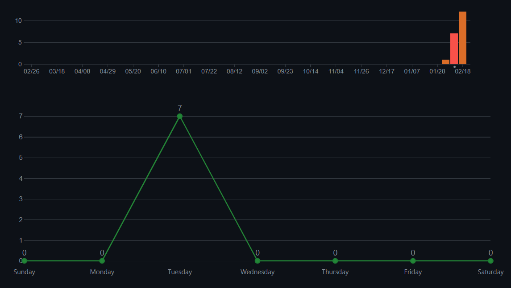

En la semana del 11 de febrero, se realizaron un total de 7 commits para las tareas correspondientes al apartado 1.3. No se encontraron conflictos en la rama master, ya que se ejecutaban ‘git pulls’ periódicamente para así tener en local los últimos cambios subidos por el resto de los compañeros.

18 FEBRERO -24 FEBRERO

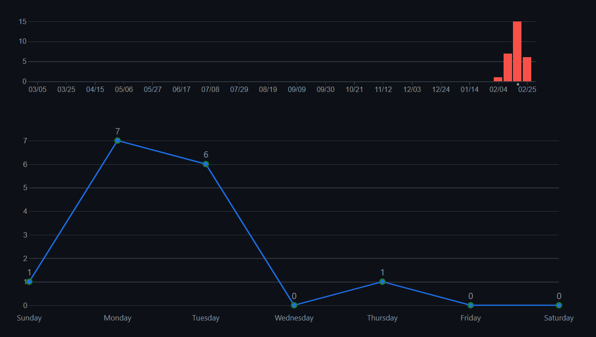

En la semana del 18 de febrero, se han realizado un total de 15 commits. Al igual que en la semana anterior, una vez que un miembro del equipo finalizaba una tarea y hacia el ‘push’ a la rama main del repositorio, el resto de los miembros del equipo se traían los cambios al repositorio local, para así evitar conflictos en la rama main al subir sus cambios.

25 FEBRERO -27 FEBRERO

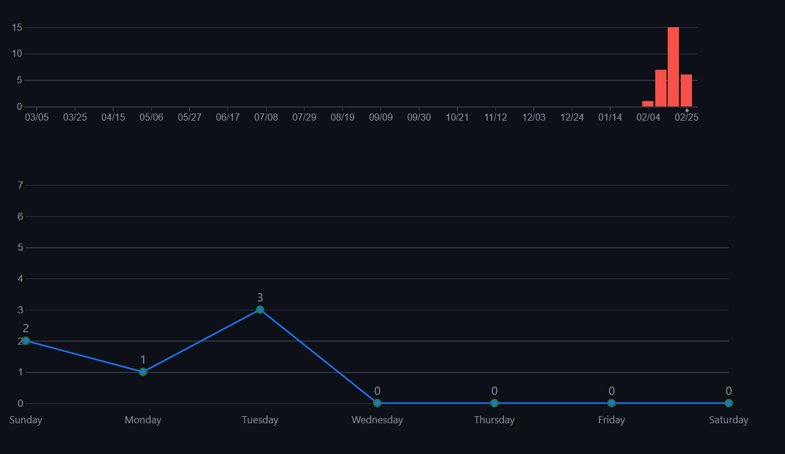

En la semana del 25 de febrero, se han realizado un total de 6 commits. Al igual que en las semanas anteriores, una vez que un miembro del equipo finalizaba una tarea y hacia el ‘push’ a la rama develop o main del repositorio, el resto de los miembros del equipo se traían los cambios al repositorio local, para así evitar conflictos en la rama main al subir sus cambios.

# 

# 4. Individual performance

## 4.1 David Blanco

Respecto a las tareas del apartado 1.6, tanto yo, como mi compañero Jun Yao, nos hemos encargado de la tarea A. La implementación de una funcionalidad para el rol ‘Clinic Owner’, que le permita gestionar un servicio de habitaciones de hotel para mascotas.

Para ello, cree una rama específica ‘feature’ en la que subir los cambios hechos en lo que respecta al desarrollo de dicha funcionalidad. Desarrollé tanto la parte de backend, como la de frontend. Sin embargo, a la hora de arrancar la app, me aparecía un error a la hora de introducir el size en el formulario de creación de una pet room. Mi compañero Yao, me ayudó a solucionar el error y finalmente pudimos implementar el requisito correctamente. Es cierto, que al haber realizado la tarea entre dos personas, al usar la misma rama, a veces surgían conflictos a la hora de introducir cambios en los mismos archivos. Sin embargo, pudimos solventarlos sin problemas mayores. Quizás, para futuras entregas, en los casos en los que haya ‘features’ implementadas por dos personas, sea interesante crear dos ramas y juntar los cambios en una para evitar conflictos. En general, pienso que la estrategia de branching seguida en esta entrega nos ha permitido trabajar de forma más eficiente y ordenada.

En las siguientes imágenes se puede apreciar la funcionalidad implementada, Pet Hotel Rooms.

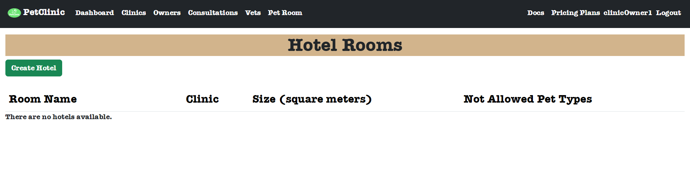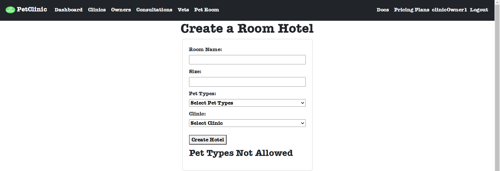

### 

## 4.2 Carlos Martín de Prado

Respecto a las tareas del apartado 1.6, me he encargado de de realizar la tarea C, la cual pedía cambiar el color de fondo de todas las cabeceras de tablas que se usarán para listar elementos en todos los usuarios. Se debía hacer en color marrón claro.

Para llevar a cabo dicha tarea, creé una rama llamada ‘feature/11-A1.6-c’ donde subí los cambios que se iban realizando.

En el desarrollo tuve que crear en un css un table-header con el color ‘saddlebrown’ (hace referencia a un marrón claro). Tras ello, fui actualizando los className adecuados para añadir dicha característica.

Cuando terminé, hice un commit and push a ‘feature/11-A1.6-c’ y abrí una pull request para hacer el merge con ‘main’ (debería haber sido con ‘develop’). Más tarde tuve que actualizar la tarea, ya que se añadió la funcionalidad de la tarea ‘A1.6-a’ y debía cambiar el color de fondo de la cabecera de la nueva tabla generada. Tras esto, hice un commit and push a ‘feature/11-A1.6-c’ y abrí una pull request para hacer el merge con ‘develop’.

Durante esta tarea, no me surgió ningún problema o conflicto, por lo que no tuve nada que solucionar.

Pienso que la estrategia de branching seguida en el desarrollo de este sprint ha sido efectiva, por lo que hemos podido trabajar adecuadamente.

En la siguiente imagen se puede apreciar la funcionalidad implementada, la cabecera de una tabla con el color marrón claro (todas las tablas han sido actualizadas con dicho color, es un ejemplo).

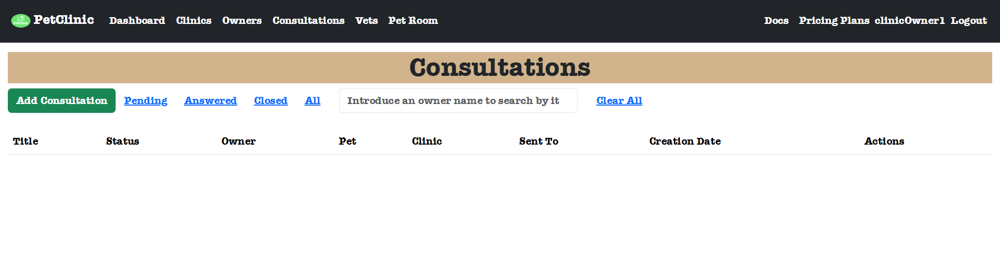

## 4.3 Lidia Jiménez Soriano

Respecto a las tareas del apartado 1.6, me he encargado de de realizar la tarea B, la cual pedía cambiar el color del gradiente de los tipos de planes disponibles en la aplicación y que los cambios se vieran reflejados para todo tipo de usuario. El color de los gradientes debían ser distintas tonalidades de marrón.

Para llevar a cabo dicha tarea, creé una rama llamada ‘feature/10-A1.6-b’ donde subí los cambios que se iban realizando.

En el desarrollo tuve que modificar los colores de los gradientes en el fichero ‘pricingPages.css’.

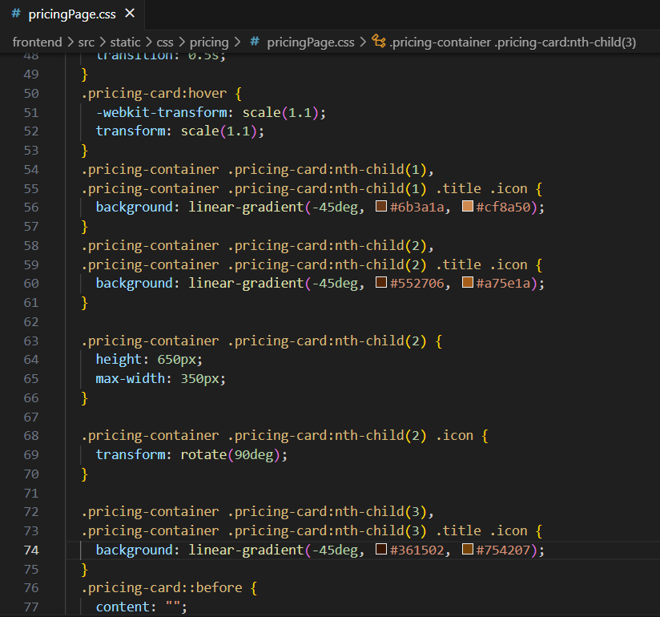

Cuando finalicé la tarea, hice un commit and push a ‘feature/11-A1.6-b’ y abrí una pull request para hacer el merge con ‘main’.

Durante el desarrollo de esta tarea no tuve ningún conflicto o problema por lo que no tuve nada que solucionar.

En mi opinión, el equipo ha trabajado de una manera eficiente durante este Sprint 1 gracias a la estrategia de branching escogida.

En la siguiente imagen se muestra la tarea implementada, se pueden observar las distintas tonalidades de marrón en los distintos planes de precio.

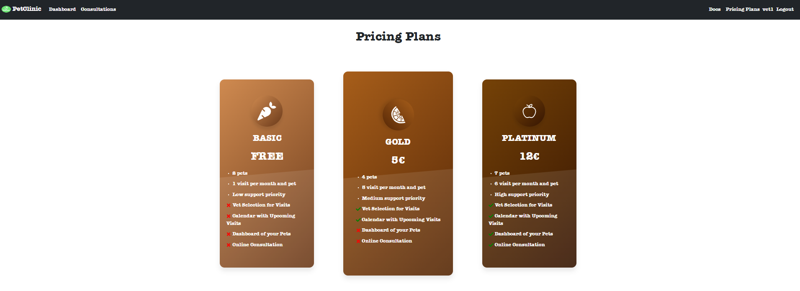

## 4.4 Juan Núñez Sánchez

Mi aportación al apartado 1.6 ha sido leve ya qué a la hora del reparto de las que componen dicho apartado no se me asignó ninguna ya qué me iba a ocupar del siguiente punto 1.8. En un principio tenía asignada la tarea junto con mi compañero Gonzalo García, pero debido a una falta de organización, Gonzalo se encargó de la tarea en su totalidad y yo del 1.8.

Sin embargo, si se pudiera hacer un apunte qué cuente como aportación relacionada para dichas tareas sería la de comprobar el correcto funcionamiento de dicho apartado en su totalidad una vez mis compañeros han mergeado sus ramas a la main y verificar en mi portatil qué efectivamente el código se ejecuta correctamente.

La organización con la que se han creado las ramas ha resultado en una comodidad y una forma de evitar conflictos a la hora de gestionar, ejecutar y controlar los cambios del código generado.

En mi opinión el equipo ha trabajado bien y se esperan conseguir los objetivos establecidos para está entrega, todo esto siguiendo lo qué se ha establecido con respecto a las ramas en Configuration Report. Es cierto que he tenido una aportación en cuanto a escritura de código leve, es por ello que para la siguiente entrega, el grupo podría mejorar el reparto de trabajos y equilibrar mejor la carga de trabajo en éste tipo de actividades.

## 4.5 Gonzalo García Lama

Yo me he encargado de realizar la tarea A1.6-d que era cambiar el comportamiento para ver las consultas según si estabas conectado como propietario de la clínica o como veterinario, para que enumere las consultas que son comentarios de la clínica para los usuarios Propietarios de la Clínica, y solo aquellas consultas que no son comentarios de la clínica para los usuarios Veterinarios.

Nuevamente cree una rama feature/12-A1.6-d y no tuve ningún conflicto ni problemas al trabajar en ella ni luego al fusionarla.

Administro capturas del código fuente modificado mejor para ver el comportamiento antes que capturas de la página, ya que en código se puede ver hasta mejor.

Primero modifiqué el *Repositorio donde hice las consultas con parámetros de lo que se requería.*

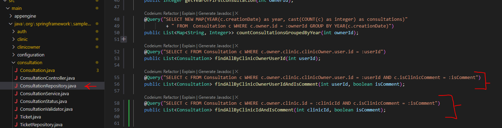

Tuve que tocar *Servicio* el cual era implementar devolviendo del repositorio las consultas personalizadas

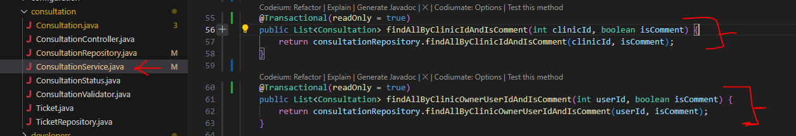

Por último modifiqué el Controlador, en el GET cuando devolviera todas las consultas, reemplazando por los 2 nuevos métodos requeridos.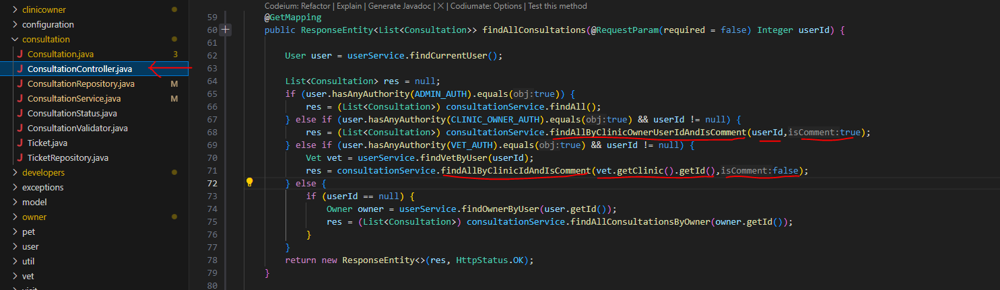

Para concluir y como Scrum Manager, y un poco coordinador, el equipo ha trabajado demasiado bien para lo que esperaba. La bifurcación por ramas y luego aclararnos fue mejor para las tareas pero aún quedan muchas cosas que mejorar.

## 4.6 Jun Yao

Respecto a las tareas del apartado 1.6, tanto yo, como mi compañero David Blanco, nos hemos encargado de la tarea A. La implementación de una funcionalidad para el rol ‘Clinic Owner’, que le permita gestionar un servicio de habitaciones de hotel para mascotas.

Para ello, al principio he desarrollado tanto el backend y frontend . Después mi compañero Davia me ha comentado que tiene un error en su parte, en este caso, tendríamos que juntar ambos códigos y al final solucionaremos el problema y he creado una rama nueva cual es feature/9-A 1.6-a.Nuevamente cree una rama feature/9-A1.6-a y no tuve ningún conflicto ni problemas al trabajar en ella ni luego al fusionarla.

La verdad en esta entrega, nos falta la comunicación entre nosotros, en el siguiente sprint , seria bien que hacemos más reuniones.

En las siguientes imágenes se puede apreciar la funcionalidad implementada, Pet Hotel Rooms.

# 5. Conclusión

En el primer apartado, al no haber seguido ninguna estrategia de branching propuesta en la asignatura, las medidas adoptadas para evitar conflictos no han sido las más óptimas. Sin embargo, en los siguientes apartados, se estableció una estrategia de branching y pudimos trabajar de forma más eficiente.

# 

# 

# 

# 

# 

# 

# 

# 

# 
