Universidad de Sevilla  
 Escuela Técnica Superior de Ingeniería Informática

**Documentación de la entrega M01**

**Documentación Configuration Report**

Grado en Ingeniería Informática – Ingeniería del Software

Proceso y Gestión Software 2

Curso 2023 – 2024

| **Fecha**  | **Versión** |
|------------|-------------|
| 28/02/2024 | v1r7        |

| **Grupo de prácticas: G5-54**    |               |                        |
|----------------------------------|---------------|------------------------|
| **Autores**                      | **Rol**       | **Correo electrónico** |
| Blanco Mora, David               | Developer     | davblamor@alum.us.es   |
| García Lama, Gonzalo             | Scrum Manager | gongarlam@alum.us.es   |
| Martín de Prado Barragán, Carlos | Developer     | carmarbar9@alum.us.es  |
| Núñez Sánchez, Juan              | Developer     | juanunsan2@alum.us.es  |
| Jiménez Soriano, Lidia           | Developer     | lidjimsor@alum.us.es   |
| Yao, Jun                         | Developer     | junyao@alum.us.es      |

Repositorio: <https://github.com/gii-is-psg2/psg2-2324-g5-54>

**Índice de contenido**

[**1. Introducción 2**](#1-introducción)

[**2. Control de Versiones 3**](#2-control-de-versiones)

[**3. Estándares de codificación 4**](#3-estándares-de-codificación)

[**4. Políticas de mensajes de commit 5**](#4-políticas-de-mensajes-de-commit)

[**5. Estructura de los repositorios y ramas predeterminadas 6**](#5-estructura-de-los-repositorios-y-ramas-predeterminadas)

[**6. Estrategia de ramificación, basada en Git Flow e incluyendo revisiones por pares 8**](#6-estrategia-de-ramificación-basada-en-git-flow-e-incluyendo-revisiones-por-pares)

[6.1. Cómo desarrollar ramas de características 8](#61-cómo-desarrollar-ramas-de-características)

[6.2. Cómo preparar lanzamientos 8](#62-cómo-preparar-lanzamientos)

[6.3 Cómo solucionar errores en producción 9](#63-cómo-solucionar-errores-en-producción)

[**7. Políticas de versionado 9**](#7-políticas-de-versionado)

[**8.Definición de “hecho” 9**](#8definición-de-hecho)

[**9.Definición de “Coordinación” 11**](#9definición-de-coordinación)

[**10.Cómo se gestionan los documentos generados durante el proyecto 12**](#10cómo-se-gestionan-los-documentos-generados-durante-el-proyecto)

[**11. Objetivos y ámbito de CMDB 13**](#11-objetivos-y-ámbito-de-cmdb)

# 1. Introducción

En este informe se detallan las directrices y políticas establecidas para la gestión del proyecto, así como los procedimientos y estándares adoptados en áreas clave como el control de versiones, la codificación, la estructura de repositorios y las estrategias de ramificación. Además, se describen las normativas referentes a la definición de tareas concluidas, la gestión de la documentación generada y otras prácticas relevantes para el desarrollo ágil del software.

Este informe, elaborado en colaboración por los autores mencionados, proporciona una visión integral de las políticas y procedimientos adoptados durante el Sprint 1, sentando así las bases para el desarrollo continuo del proyecto en los siguientes ciclos de trabajo.

# 

# 2. Control de Versiones

| **Fecha**  | **Versión** | **Descripción**                               | **Sprint** |
|------------|-------------|-----------------------------------------------|------------|
| 20/02/2024 | v1r0        | Creación del documento                        | 1          |
| 21/02/2024 | v1r1        | Integración de los puntos restantes           | 1          |
| 23/02/2024 | v1r2        | Completación de información en algunos puntos | 1          |
| 27/02/2024 | v1r3        | Actualización de puntos con ejemplos          | 1          |
| 27/02/2024 | v1r4        | Modificaciones en puntos con capturas         | 1          |
| 27/02/2024 | v1r5        | Añadido apartado 10 “CMDB”                    | 1          |
| 28/02/2024 | v1r6        | Añadida “Definición de Coordinación”          | 1          |
| 28/02/2024 | v1r7        | Entrega                                       | 1          |

# 3. Estándares de codificación

Para mantener un código coherente y legible, se siguen las siguientes normas de codificación:

\- Para el **nombrado de variables locales**, variables globales y constantes se usarán nombres descriptivos y siguiendo las siguientes reglas:

**Variables Locales:** Para el nombrado de variables locales siempre las escribiremos en minúscula excepto para la primera letra de cada palabra, exceptuando la primera, es decir, se usará la regla ‘**camelCase**’ (e.j localVariable).

**Variables Globales:** Para el nombrado de variables locales siempre las escribiremos en minúscula excepto para la primera letra de cada palabra (e.j GlobalVariable ).

**Constantes:** Para el nombrado de constantes usaremos solo letras mayúsculas (e.j CONSTANT)

En la siguiente imagen de nuestro proyecto, en concreto en la clase implementada **‘PetHotelController’**, se pueden observar varias variables que siguen las normas de codificación: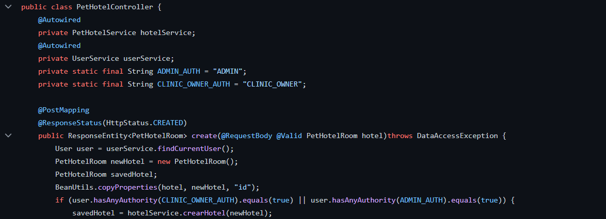

\- **Indentación** consistente en todo el proyecto para mejorar la calidad del código y que sea legible y tenga un formato coherente. La sangría facilita la identificación de fragmentos de código y fortalece la organización general del código.

\- **Comentar el código** de manera clara y concisa. Esto además aporta actúan como un recurso útil para otros programadores que luego necesiten agregar o modificar el código.

\- **Evitar la duplicación de código** mediante la reutilización y la modularidad. Esto acelera el desarrollo, asegura la consistencia y reduce la posibilidad de cometer errores.

\-**Control de versiones y colaboración** resulta esencial para el desarrollo web moderno. El uso de herramientas de control de versiones como Git facilita la colaboración y el avance del proyecto de forma óptima.

\-**Pruebas** ayudan a asegurarse de que se entregue código de alta calidad. Es más fácil de encontrar y solucionar problemas al principio del proceso de desarrollo cuando se utilizan pruebas unitarias y pruebas de integración.

\-**Aprendizaje y mejora continua** los desarrolladores debemos adoptar una mentalidad de continua aprendizaje y mejora para producir código de la más alta calidad durante todas las fases de desarrollo.

# 4. Políticas de mensajes de commit

Los mensajes de commit deberán ser descriptivos y concisos, incluyendo información relevante sobre los cambios realizados. Se siguen las siguientes convenciones:

\-Uso de verbos en **modo imperativo** en el título.

\-**Prefijar los mensajes** de commit con uno de los siguientes tipos:

**- tarea**: para las tareas que hemos hecho individualmente.

**- fix**: para correcciones de errores.

**- docs**: para cambios en la documentación.

**- test:** para cuando se añadan tests

\-No usar **puntos finales** ni suspensivos al final del título.

\-El mensaje de commit no deberá contener ningún mensaje de **espacios en blanco**.

\-Ser **corto y conciso** en los títulos, para ello se establecen un máximo de 50 caracteres.

\-**Uso de mayúsculas** al inicio del título y por cada párrafo del cuerpo del mensaje.

Ejemplos de commits realizados durante este Sprint con la política explicada anteriormente: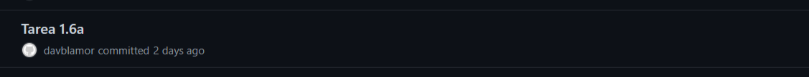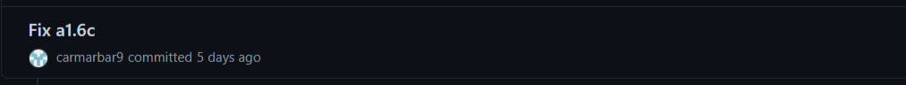

# 5. Estructura de los repositorios y ramas predeterminadas

El modelo planteado en la asignatura es el siguiente:

# 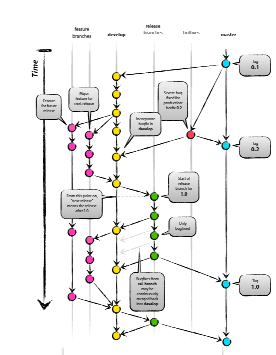

Para cada tarea o funcionalidad que se vaya a implementar, crearemos una rama(las llamadas feature branches). Y una vez veamos que la funcionalidad implementada funciona perfectamente, la subimos a la rama develop.

Una vez implementadas todas las funcionalidades previstas,se crea una release branch, en la cual aplicaremos cambios de última hora de cara a la entrega.

Finalmente subimos los cambios a la rama main, de cara a su puesta en producción.

En el contexto de nuestro proyecto, hemos seguido un esquema similar a lo recomendado en la norma, ya que creemos que se adapta perfectamente a nuestro proyecto al trabajar varios desarrolladores a la vez.

En la siguiente imagen se pueden apreciar las ramas creadas en nuestro repositorio:

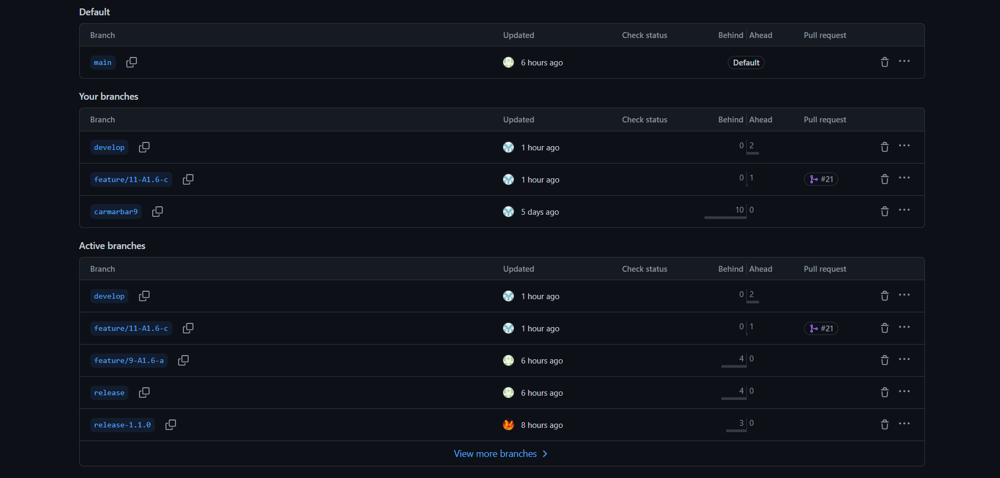

En la siguiente imagen se puede apreciar la ramificación de nuestro proyecto:

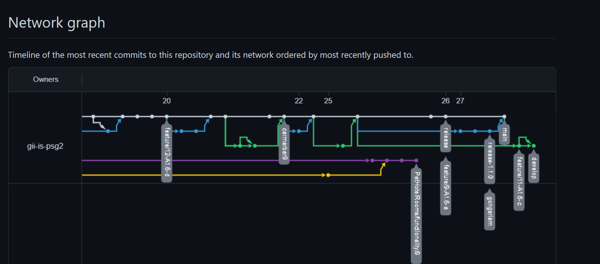

# 6. Estrategia de ramificación, basada en Git Flow e incluyendo revisiones por pares

## 6.1. Cómo desarrollar ramas de características

Las ramas features son ramificaciones de la rama principal “develop”, la cual de por sí se ramifica de “main”. Estas features se utilizarán para la implementación de funcionalidades individuales que luego se hará un merge con develop y que no deben crear problemas de compilación ni conflictos varios.

Las ramas tendrán como nombre “feature/{idIssue}-{idProductBacklog}”. Ejemplo: feature/9-A1.6-a: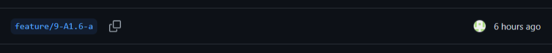

En definitiva, una vez hecho el merge con la rama “develop” se obtendrá una versión que funciona pero que aún no tiene una funcionalidad completa que entregar al cliente.

## 6.2. Cómo preparar lanzamientos

Dependiendo de del tipo de versión/incremento que se vaya a realizar:

\- Se considerará que se puede realizar una nueva versión mayor cuando cambiemos de Sprint, es decir cuando todas las tareas del Sprint Backlog estén hechas.

\- Se considerará que se puede realizar una nueva versión menor cuando todas las subtareas de una tarea concreta estén hechas. Estas son las tareas de código que tengan un identificador de tarea igual en el Product Backlog (un ejemplo de esto serían las 2.5x, donde x es la letra que identifica a la tarea).

\- Se considerará que se puede realizar un parche cuando se detecte algún error dentro del código y pueda ser arreglado.

## 6.3 Cómo solucionar errores en producción

Cuando se detecte un problema, lo solucionará el creador del código que dé fallo, si fuese posible.

Si el error se detecta durante la preparación de una versión, el parche será realizado en la rama de “release”. El merge se haría a las ramas “main” y “release”.

Si el error se detecta para una versión final anterior en la rama “main”, el parche será realizado en la rama de “hotfix”. El merge se haría a las ramas “main” y “develop”.

# 7. Políticas de versionado

La política de versionado se centra en definir una etiqueta indicando una versión estable del proyecto. En nuestro caso se seguirá la siguiente estructura **v.x.y.z**:

-   **x:** indica que es una versión con cambios mayores, siendo la versión alfa del proyecto la 1.0.
-   **y:** indica que el proyecto se han realizado cambios menores. Estos cambios pueden representar la finalización de conjuntos de tareas de código estables (un ejemplo serían todas las tareas de código con el prefijo A1.8).
-   **z:** indica la versión de parche o que han habido cambios en la rama hotfix para solucionar algún error.

Para clarificación, se presentan los siguientes ejemplos:

-   **v.1.0.0** representará la primera release del proyecto.
-   **v.1.1.0** representará que se ha realizado un conjunto de tareas.
-   **v.2.1.2** representará la segunda release, con un conjunto de tareas ya implementadas y 2 parches realizados.

Hemos elegido la estructura **v.x.y.z** ya que creemos que se adecua bastante a nuestro proyecto, y nos resulta bastante familiar al haberla estudiado en teoría.

# 8.Definición de “hecho”

**-Tareas de código**: Una tarea de código se denominará como hecha en el momento en que funcione, añada la funcionalidad descrita en la tarea y no comprometa al sistema.

Además, la tarea debe estar dentro de la columna Done en el tablero del proyecto de GitHub, para llegar a este estado previamente debe ser supervisada por todos los miembros del grupo distinto al individuo que ha realizado la tarea (la tarea se encontrará previamente en la columna Review).

Ejemplo de tareas marcada cómo Review y cómo Done:

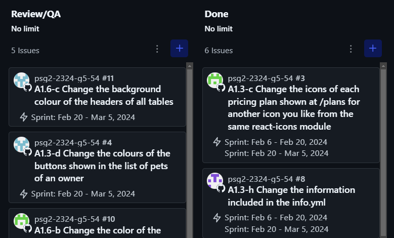

**-Tareas de documentación**: Una tarea de documentación se denominará como hecha cuando sea revisada por todo el grupo y en consenso se tome como terminada, para ello el documento debe contener todos los puntos y características proporcionados en el Product Backlog, además de no contener ninguna falta de ortografía y estar redactado de manera clara y concisa. Esta definición aplica solo a las tareas de documentación realizadas en grupo. Las tareas de documentación individuales seguirán la definición de hecho del redactor.

# 9.Definición de “Coordinación”

El equipo se organiza alrededor de un scrum manager y el resto de integrantes denominados como developers. Se ha recopilado y desglosado las actividades a realizar en sus respectivas sub-tareas para repartir y equilibrar mejor la carga de trabajo.

Para las tareas de código nos hemos organizado con las ramas qué hemos comentado anteriormente lo cual nos permite trabajar de manera coordinada y eficiente.

Para las tareas de documentación hemos usado documentos que nos permite la escritura simultánea y coordinada de todos los documentos qué se van a generar durante este sprint.

Desglose de tareas:

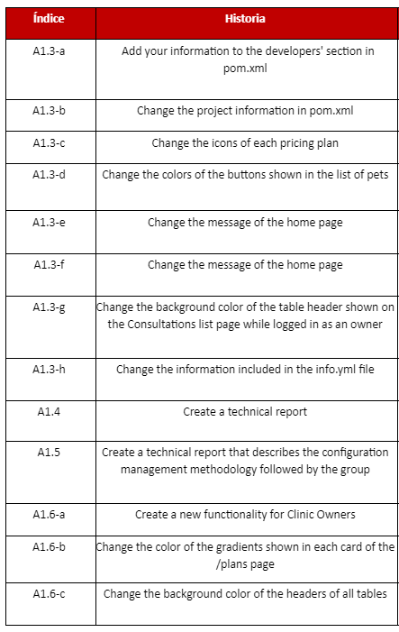

Como selección de puntos de historia en las tareas, hemos usado la estrategia de Poker para evaluar la dificultad y el tiempo que nos podría llevar en esas tareas.

# 10.Cómo se gestionan los documentos generados durante el proyecto

Los documentos se gestionan dentro de una carpeta **‘docs’** en la rama principal del proyecto. Esta carpeta consta de otras carpetas dentro para hacer referencia a los respectivos Sprints, ‘MilestoneX’, siendo X el número que hace referencia a cada Sprint.

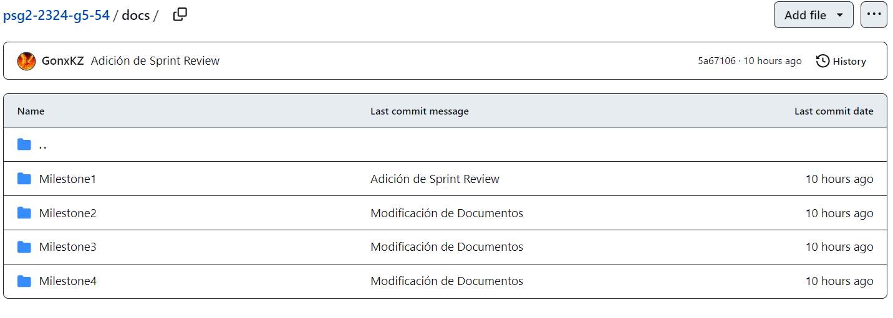

Dentro de cada carpeta de Sprint, se tendrán en cuenta los siguientes documentos:

-   Informes de Scrum Diarios
-   Reuniones
-   Retrospectiva del Sprint
-   Revisión del Sprint
-   Planificación del Sprint

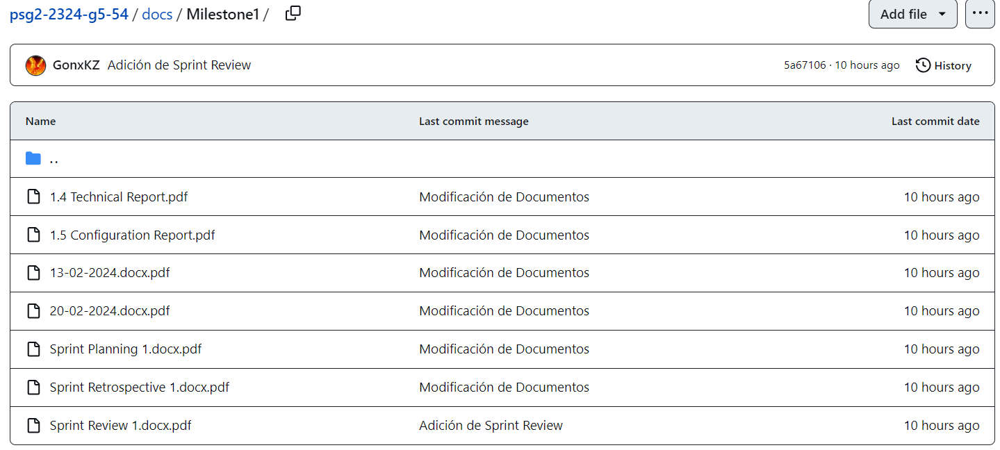

# 11. Objetivos y ámbito de CMDB

Hemos utilizado la funcionalidad de CMDB (Base de Datos de Configuración) en iTop con los siguientes objetivos:

-   Gestionar servicios de TI, activos y operaciones de manera estructurada y eficiente.
-   Gestionar incidentes y problemas.
-   Servir apoyo a la definición de lo hecho
-   Control y seguimiento de Cambios

En nuestro caso contamos hemos añadido varios elementos de configuración, contamos con:

-   6 ordenadores que cada uno corresponde al portátil personal de cada uno de los integrantes del grupo.
-   3 PC Software´s instalados en los ordenadores comentados anteriormente
-   1 Application Solution
-   2 Serveridores
-   1 Periférico

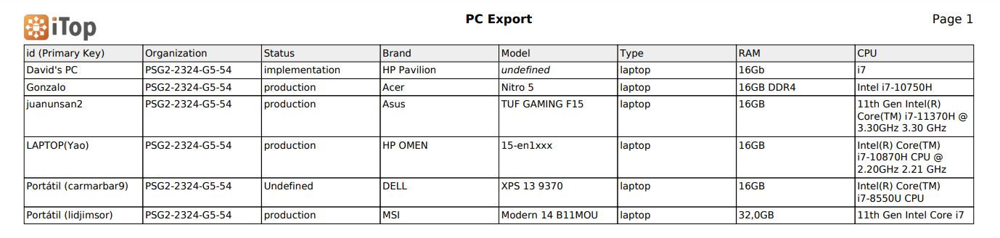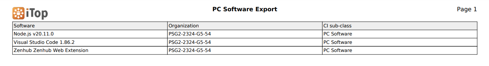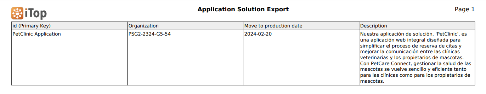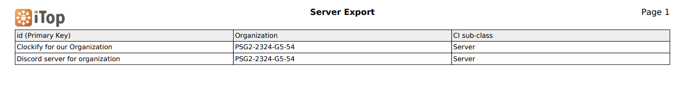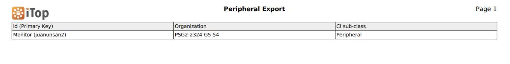

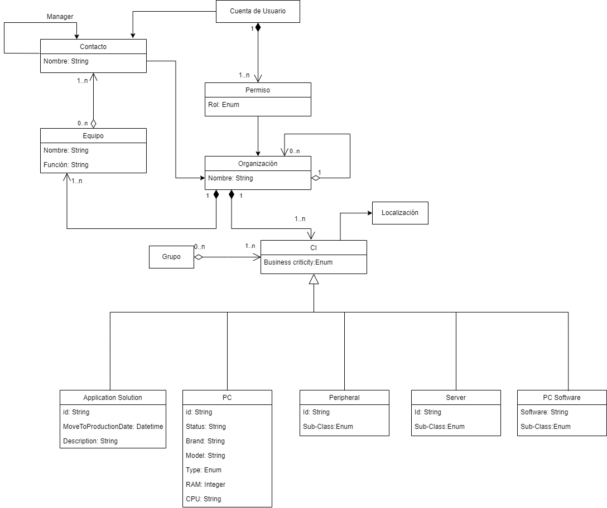
