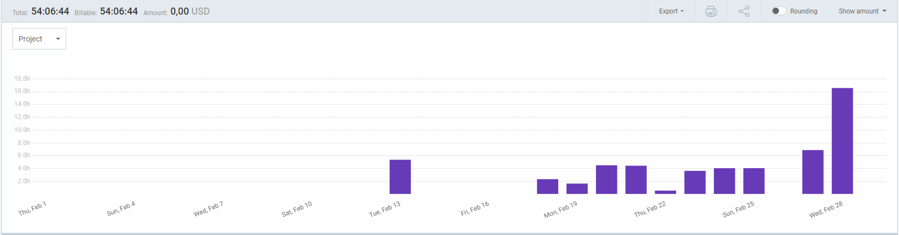
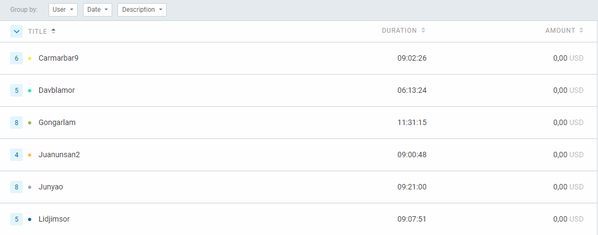
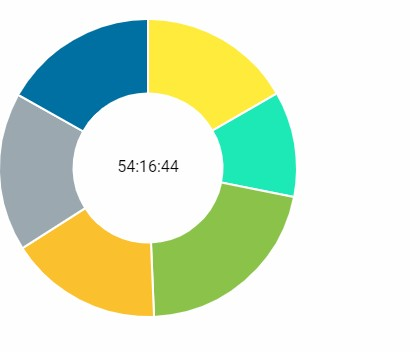

Universidad de Sevilla

## Escuela Técnica Superior de Ingeniería Informática

**Documentación de la entrega M01**

**Documento de Clockify**

### Grado en Ingeniería Informática – Ingeniería del Software Proceso y Gestión Software 2

### Curso 2023 – 2024

| **Fecha**  | **Versión** |
|------------|-------------|
| 28/02/2024 | v1r2        |

| **Grupo de prácticas: G5-54**    |               |                                                       |
|----------------------------------|---------------|-------------------------------------------------------|
| **Autores**                      | **Rol**       | **Correo electrónico**                                |
| Blanco Mora, David               | Developer     | [davblamor@alum.us.es](mailto:davblamor@alum.us.es)   |
| García Lama, Gonzalo             | Scrum Manager | [gongarlam@alum.us.es](mailto:gongarlam@alum.us.es)   |
| Martín de Prado Barragán, Carlos | Developer     | [carmarbar9@alum.us.es](mailto:carmarbar9@alum.us.es) |
| Juan Núñez Sánchez               | Developer     | [juanunsan2@alum.us.es](mailto:juanunsan2@alum.us.es) |
| Jiménez Soriano, Lidia           | Developer     | [lidjimsor@alum.us.es](mailto:lidjimsor@alum.us.es)   |
| Yao, Jun                         | Developer     | [junyao@alum.us.es](mailto:junyao@alum.us.es)         |

Repositorio: <https://github.com/gii-is-psg2/psg2-2324-g5-54>

##### Índice de contenido

1.  [Introducción 2](#introducción)
2.  [Control de Versiones 2](#control-de-versiones)
3.  [Horas de Clockify 3](#horas-de-clockify)
4.  [Conclusiones 5](#conclusiones)

# Introducción

Con Clockify, cada miembro del equipo tiene la capacidad de registrar y monitorear su tiempo de manera individual, proporcionando una visión detallada de cómo se distribuyen las horas a lo largo del día y de los proyectos. Esta información no solo ayuda a entender mejor cómo se utilizan los recursos, sino que también facilita la planificación futura y la toma de decisiones informadas.

# Control de Versiones

| **Fecha**  | **Versión** | **Descripción**                      |
|------------|-------------|--------------------------------------|
| 26/02/2024 | v1r0        | Generación del documento             |
| 28/02/2024 | v1r1        | Finalización del documento y entrega |
|            |             |                                      |
|            |             |                                      |

# Horas de Clockify

En general se ha ido trabajando después de la primera semana. Se puede observar como al final del todo se emplearon muchas numerosas horas de parte del equipo para llegar a los objetivos necesitados.

A continuación se puede ver filtrado el número de horas empleado por cada miembro del equipo, con cuantas tareas registradas de Clockify[numerito]

Por último se muestra en proporción la cantidad de horas en un gráfico de torta.

Los respectivos porcentajes son:

#### Gonzalo; 21,23%

#### Lidia; 16,82%

#### David; 11,47%

#### Carlos; 16,66%

#### Jun; 17,23%

#### Juan; 16,61%

# Conclusiones

# 

Tras analizar los gráficos, la mayoría de la actividad ha estado en la última semana ya que es cuando el equipo ha estado más enfocado en el trabajo de las tareas de documentación. El reparto de horas ha sido más o menos equitativo pero para próximos Sprints se tratará de igualar a los miembros del equipo que han tenido menos horas para que así no haya sobre carga de trabajo.

Para las siguientes entregas se espera mejorar las enradas en clockify y la comunicación entre los miembros del grupo para que así ninguno haga trabajo de más.
