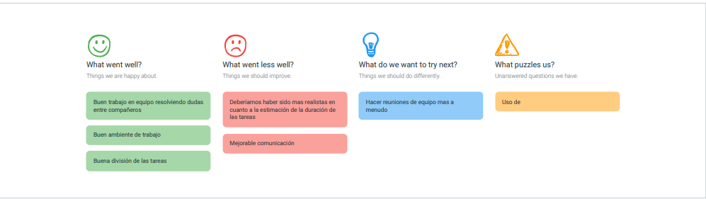

Universidad de Sevilla  
 Escuela Técnica Superior de Ingeniería Informática

**Documentación de la entrega M01**

**Documentación Sprint Retrospective**

Grado en Ingeniería Informática – Ingeniería del Software

Proceso y Gestión Software 2

Curso 2023 – 2024

| **Fecha**  | **Versión** |
|------------|-------------|
| 28/02/2024 | v1r3        |

| **Grupo de prácticas: G5-54**    |               |                        |
|----------------------------------|---------------|------------------------|
| **Autores**                      | **Rol**       | **Correo electrónico** |
| Blanco Mora, David               | Developer     | davblamor@alum.us.es   |
| García Lama, Gonzalo             | Scrum Manager | gongarlam@alum.us.es   |
| Martín de Prado Barragán, Carlos | Developer     | carmarbar9@alum.us.es  |
| Juan Núñez Sánchez               | Developer     | juanunsan2@alum.us.es  |
| Jiménez Soriano, Lidia           | Developer     | lidjimsor@alum.us.es   |
| Yao, Jun                         | Developer     | junyao@alum.us.es      |

Repositorio: <https://github.com/gii-is-psg2/psg2-2324-g5-54>

**Índice de contenido**

[**1. Introducción 2**](#1-introducción)

[**2. Control de Versiones 2**](#2-control-de-versiones)

[**3. Evaluaciones 2**](#3-evaluaciones)

[**4. Valoración Sprint de los integrantes del grupo. 3**](#4-valoración-sprint-de-los-integrantes-del-grupo)

[4.1 Aspecto de mejoras: 4](#41-aspecto-de-mejoras)

[**5. Conclusión 5**](#5-conclusión)

# 1. Introducción

En el presente documento, a raíz de lo realizado en el primer Sprint, se han puesto en común entre los miembros del grupo, aspectos a mejorar y a contemplar de cara a futuros sprints.Con el fin de garantizar que se incorporen los aprendizajes clave para las futuras entregas.

# 2. Control de Versiones

| **Fecha**  | **Versión** | **Descripción**                        |
|------------|-------------|----------------------------------------|
| 23/02/2024 | v1r0        | Primera versión del documento          |
| 25/02/2024 | v1r1        | Adición del contenido punto 3          |
| 28/02/2024 | v1r2        | Valoración de integrantes y conclusión |
| 28/02/2024 | v1r3        | Entrega                                |

# 3. Evaluaciones

# 

# 

# 

# 4. Valoración Sprint de los integrantes del grupo.

# 

|                                  | Sprint |      |      |       |                     |
|----------------------------------|--------|------|------|-------|---------------------|
| Miembro del Equipo               | S1     | S2   | S3   | Total | Media Entregable D1 |
| Blanco Mora, David               | 5      | 4,95 | 4,95 | 14,9  | 4,96                |
| García Lama, Gonzalo             | 5      | 5,75 | 5,75 | 16,5  | 5,5                 |
| Martín de Prado Barragán, Carlos | 5      | 4,8  | 4,8  | 14,6  | 4,87                |
| Núñez Sánchez, Juan              | 5      | 4,8  | 4,8  | 14,6  | 4,87                |
| Jiménez Soriano, Lidia           | 5      | 4,8  | 4,8  | 14,6  | 4,87                |
| Yao, Jun                         | 5      | 4,9  | 4,9  | 14,8  | 4,93                |
| Total                            | 30     | 30   | 30   | 90    | 30                  |

## 

## 

## 4.1 Aspecto de mejoras:

Hemos elaborado las notas de esta forma en función al nivel de compromiso, y los trabajos realizados con el grupo. Sin embargo, hemos localizado que deberíamos tener mayor coordinación entre miembros del equipo para equilibrar cargas de trabajo. También deberíamos tener por ciertos integrantes mayor compromiso del equipo, y llevar las tareas de una forma más óptima debido a que ya nos hemos familiarizado con las herramientas de trabajo para elaborar el proyecto.

Con respecto a Clockify un aspecto de mejora a mencionar sería el compromiso y estar atento a iniciar el cronómetro de una actividad correctamente y evitar la adición de dichas tareas de forma manual. Además mencionar qué el compañero David Blanco no ha podido asistir a la reunión final de forma justificada, por tanto su tiempo en clockify será inferior pero no se tendrá en cuenta.

# 5. Conclusión

En general, en este Sprint 1 el grupo ha trabajado de manera eficiente y ordenada, con una buena resolución de dudas entre miembros, un ambiente de trabajo tranquilo y que fomenta la concentración y un buen reparto de tareas para que ninguno tuviera sobrecarga de trabajo.

Se podría haber mejorado la comunicación entre compañeros y el realismo en cuanto a las duraciones de las tareas ya que muchas de ellas eran demasiado sencillas y han llevado poco tiempo a su desarrollador, mientras que otras eran demasiado extensas y hubieran necesitado de otro desarrollador más.

Para los próximos Sprints el grupo debe llevar a cabo más reuniones de trabajo para fomentar la comunicación y que el desarrollo de las tareas sea aún más eficiente y ordenado.

# 

# 
