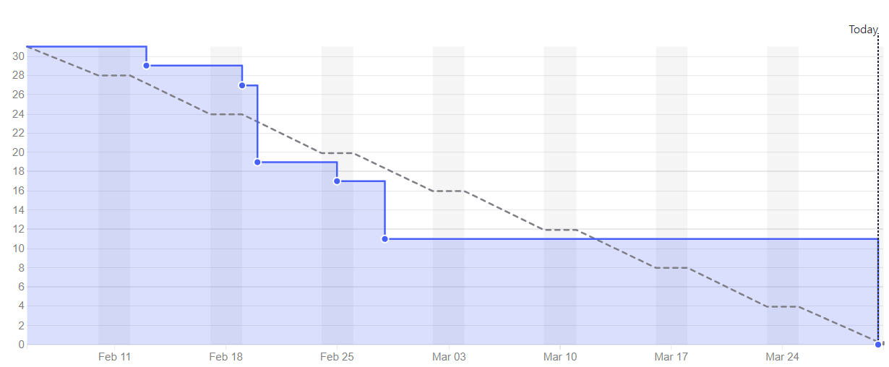
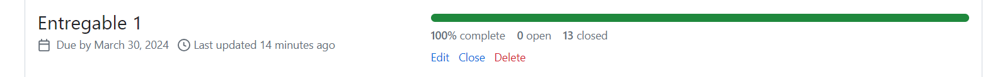
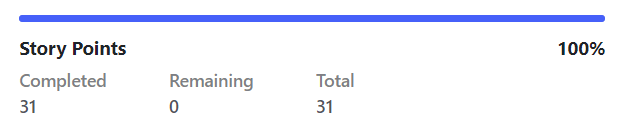
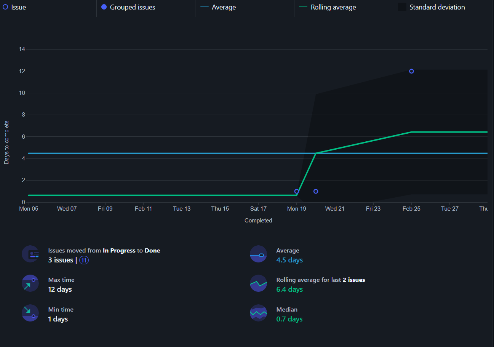
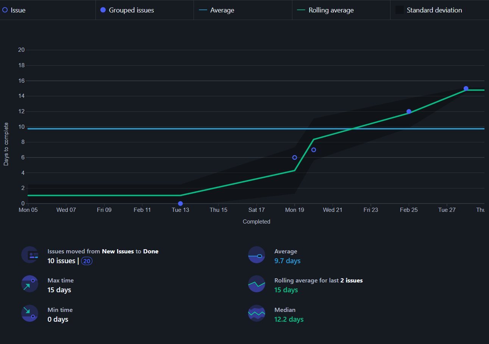
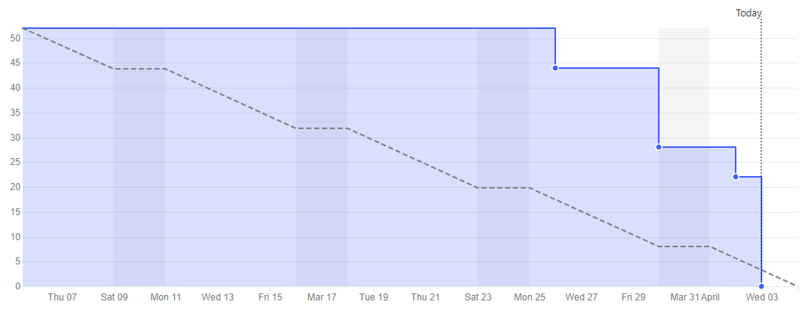
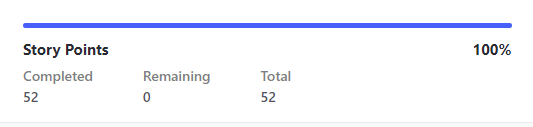
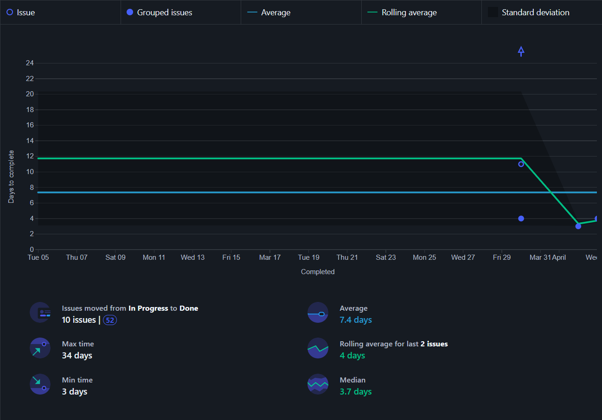
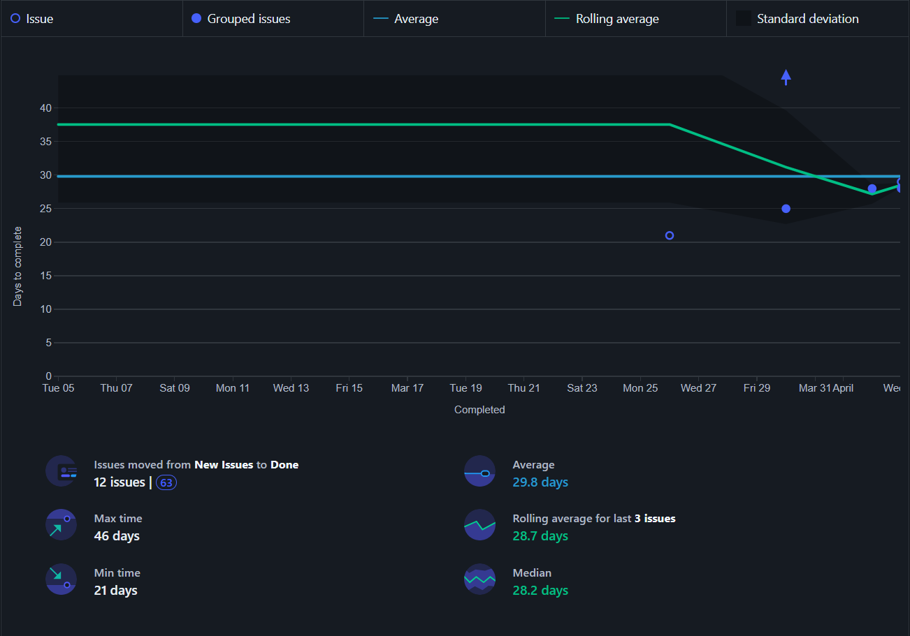

Universidad de Sevilla  
 Escuela Técnica Superior de Ingeniería Informática

**Documentación de la entrega -D02-**

**Documentación Métricas de Proceso Ágil y Recursos**

Grado en Ingeniería Informática – Ingeniería del Software

Proceso y Gestión Software 2

Curso 2023 – 2024

| **Fecha**  | **Versión** |
|------------|-------------|
| 30/03/2024 | v1r0        |

| **Grupo de prácticas: G5-54**    |               |                        |
|----------------------------------|---------------|------------------------|
| **Autores**                      | **Rol**       | **Correo electrónico** |
| Blanco Mora, David               | Desarrollador | davblamor@alum.us.es   |
| García Lama, Gonzalo             | Scrum Manager | gongarlam@alum.us.es   |
| Martín de Prado Barragán, Carlos | Desarrollador | carmarbar9@alum.us.es  |
| Juan Núñez Sánchez               | Desarrollador | juanunsan2@alum.us.es  |
| Jiménez Soriano, Lidia           | Desarrollador | lidjimsor@alum.us.es   |
| Yao, Jun                         | Desarrollador | junyao@alum.us.es      |

Repositorio: <https://github.com/gii-is-psg2/psg2-2324-g5-54>

**Índice de contenido**

[**1. Introducción 2**](#1-introducción)

[**2. Control de Versiones 2**](#2-control-de-versiones)

[**3. Sprint 1 3**](#3-sprint-1)

[**3.1. Burn Down Chart 3**](#31-burn-down-chart)

[2.1.1 Percentage of history points delivered. 3](#211-percentage-of-history-points-delivered)

[2.1.2 Total history points delivered 4](#212-total-history-points-delivered)

[**3.2. Control Chart con Cycle Time 5**](#32-control-chart-con-cycle-time)

[**3.3. Control Chart con Lead Time 6**](#33-control-chart-con-lead-time)

[**4. Sprint 2 7**](#4-sprint-2)

[4.1. Burn Down Chart 7](#41-burn-down-chart)

[2.1.1 Percentage of history points delivered. 7](#211-percentage-of-history-points-delivered-1)

[4.2. Control Chart con Cycle Time 9](#42-control-chart-con-cycle-time)

[4.3. Control Chart con Lead Time 10](#43-control-chart-con-lead-time)

# 1. Introducción

Este informe detalla las medidas de desempeño para los Sprint 1 y Sprint 2. Tanto para el Sprint 1 como para el Sprint 2 se utilizaron las funciones de ZenHub para generarlas.

# 2. Control de Versiones

| **Fecha**  | **Versión** | **Descripción**            |
|------------|-------------|----------------------------|
| 31/02/2024 | v1r0        | Primera versión y creación |
| 03/03/2024 | v1r1        | Finalización               |
|            |             |                            |
|            |             |                            |

# 3. Sprint 1

## 3.1. Burn Down Chart

### 2.1.1 Percentage of history points delivered.

### 

Se ha entregado un total de 31 puntos de historia de los31 qué había qué entregar, por tanto se han entregado el 100% de los puntos de historia.

### 2.1.2 Total history points delivered

| Tarea                                                                                                                   | Estimación |
|-------------------------------------------------------------------------------------------------------------------------|------------|
| A1.3-a Add your information to the developers section in pom.xml                                                        | 1          |
| A1.3-b Change the project information in pom.xml according to the following attributes                                  | 1          |
| A1.3-c Change the icons of each pricing plan shown at /plans for another icon you like from the same react-icons module | 1          |
| A1.3-d Change the colours of the buttons shown in the list of pets of an owner                                          | 2          |
| A1.3-e Change the message of the home page to “Welcome to the PSG2-2324-GX-XY Petclinic                                 | 1          |
| A1.3-f Change the image of the home page with another pet you like                                                      | 1          |
| A1.3-g Change the background colour of the table header shown on the Consultations list pag                             | 2          |
| A1.3-h Change the information included in the info.yml                                                                  | 1          |
| A1.6-a Create a new functionality for Clinic Owners                                                                     | 8          |
| A1.6-b Change the color of the gradients shown in each card of the /plans page                                          | 3          |
| A1.6-c Change the background colour of the headers of all tables                                                        | 2          |
| A1.6-d Change the behaviour of the Consultations page                                                                   | 8          |

Se debe mencionar qué las tareas A1.6-a y A1.6-b ha habido un problema con ellas ya que en github aparecían correctamente cerradas, además, en zenhub se encontraban en la pipeline correcta. No obstante, al generar el "burn down chart" estas dos tareas no aparecían como cerradas. Hemos llegado a la conclusión de qué se trataba de un bug y lo hemos solucionado abriendolas y volviendolas a cerrar, haciendo esto ya salían en la gráfica correctamente, es por ello qué salen como cerradas a fecha de 30/03/2024.

## 

## 3.2. Control Chart con Cycle Time

Se debe mencionar que durante el Sprint 1 la mayoría de issues pasaron de ‘New Issue’ a ‘Done’ y, por ello, el Control Chart con Cycle Time solo nos muestra tres issues que pasaron de ‘In progress’ a ‘Done’.

## 3.3. Control Chart con Lead Time

# 

# 

# 4. Sprint 2

## 4.1. Burn Down Chart

### 2.1.1 Percentage of history points delivered.

Se ha entregado un total de 52 puntos de historia de los 52 qué había qué entregar, por tanto se han entregado el 100% de los puntos de historia.

2.1.2 Total history points delivered

| Tarea                                                                                                                                                       | Estimación |
|-------------------------------------------------------------------------------------------------------------------------------------------------------------|------------|
| A2.2-a Add the Booking functionality for the pet hotel rooms                                                                                                | 8          |
| A2.2-b Create an Adoptions functionality                                                                                                                    | 8          |
| A2.2-c Develop a comprehensive suite of unit tests                                                                                                          | 3          |
| A2.3 Prepare a release of the Petclinic project                                                                                                             | 5          |
| A2.4 Create a technical report (in Spanish) entitled “Métricas de Proceso Ágil y Recursos”                                                                  | 8          |
| A2.5-a A screenshot of the SonarQube dashboard for the analysis of your project and a description of the metrics provided in the dashboard and their values | 3          |
| A2.5-b Description and analyses of the potential bugs found in the repository                                                                               | 3          |
| A2.5-c Description and analysis of the different types code smells found in the analyses                                                                    | 5          |
| A2.5-d Conclusions about the results of the analyses.                                                                                                       | 1          |
| A2.6 Reports regarding meeting minutes                                                                                                                      | 8          |

## 4.2. Control Chart con Cycle Time

Se debe mencionar, que debido a un error de Zenhub en el Sprint 1, tuvimos que volver a mover a ‘Done’ una issue de dicho Sprint y por eso aparece la flecha refiriéndose a ésta. También debemos reconocer nuestros errores y por ello el gráfico no es adecuado, ya que movimos tarde a ‘Done’ algunas issues.

## 

## 4.3. Control Chart con Lead Time

Con este gráfico nos vuelve a pasar lo mismo que con el anterior, incluido el error de Zenhub sobre el Sprint 1. Se mejorará para el próximo Sprint.

## Extra E.1
Durante el Sprint S2, el equipo de desarrollo detectó una serie de deficiencias tanto en el backend como en el frontend del proyecto en curso. Estos fallos incidieron negativamente en la funcionalidad y estabilidad del sistema. En el backend, se observó una práctica inadecuada en el uso de los métodos de comparación, particularmente la comparación directa de objetos mediante el operador ==, en lugar de recurrir a la comparación de sus hashcodes o valores, lo que generaba inconsistencias en los datos y comportamientos inesperados. Por su parte, en el frontend se identificaron varios errores relacionados con aspectos no esenciales de la interfaz de usuario, como la apariencia de ciertos elementos o la disposición incorrecta de componentes en la pantalla.

Para subsanar estos inconvenientes, en el sprint actual se llevó a cabo una meticulosa labor de corrección de errores. El equipo de desarrollo se enfocó en identificar y rectificar todas las incidencias reportadas, priorizando aquellas que impactaban de manera más significativa en la experiencia del usuario o en la funcionalidad del sistema. En el backend, se procedió a revisar y refactorizar los métodos de comparación con el objetivo de garantizar su utilización adecuada, evitando así errores derivados de la comparación directa de objetos. Paralelamente, se implementaron pruebas exhaustivas para validar el correcto funcionamiento de estas correcciones y evitar posibles regresiones.

En lo que respecta al frontend, se llevó a cabo una revisión exhaustiva de la interfaz de usuario con el propósito de identificar y corregir cualquier inconveniente relacionado con la apariencia o la interacción de los elementos en pantalla. Se prestó especial atención a aquellos errores que pudieran afectar la usabilidad del sistema o la experiencia del usuario. Además, se realizaron pruebas de usuario para verificar que las correcciones realizadas satisfacían las necesidades y expectativas de los usuarios finales.

Como resultado de estas acciones, se logró reducir de manera significativa la carga de deuda técnica en el proyecto. Se solucionaron numerosos errores catalogados como Major Bugs y Critical Bugs, lo que contribuyó a mejorar la estabilidad y confiabilidad del sistema. Además, se abordaron varios Minor Bugs que, aunque de menor impacto, incidían en la percepción general de calidad del producto. Esta disminución en la carga de deuda técnica no solo beneficia al equipo de desarrollo al facilitar el mantenimiento y la evolución del sistema, sino que también mejora la satisfacción y experiencia del usuario final. En resumen, el equipo ha logrado un avance significativo desde el Sprint S2, demostrando su capacidad para identificar, abordar y superar los desafíos técnicos en el desarrollo del proyecto.

Este informe lo hemos realizado todo el equipo en conjunto.

