Universidad de Sevilla  
 Escuela Técnica Superior de Ingeniería Informática

**Documentación de la entrega 02**

**Documentación Análisis del Código Fuente y Métricas Asociadas**

Grado en Ingeniería Informática – Ingeniería del Software

Proceso y Gestión Software 2

Curso 2023 – 2024

| **Fecha**  | **Versión** |
|------------|-------------|
| 30/03/2024 | v1r1        |

| **Grupo de prácticas: G5-54**    |               |                        |
|----------------------------------|---------------|------------------------|
| **Autores**                      | **Rol**       | **Correo electrónico** |
| Blanco Mora, David               | Desarrollador | davblamor@alum.us.es   |
| García Lama, Gonzalo             | Scrum Manager | gongarlam@alum.us.es   |
| Martín de Prado Barragán, Carlos | Desarrollador | carmarbar9@alum.us.es  |
| Juan Núñez Sánchez               | Desarrollador | juanunsan2@alum.us.es  |
| Jiménez Soriano, Lidia           | Desarrollador | lidjimsor@alum.us.es   |
| Yao, Jun                         | Desarrollador | junyao@alum.us.es      |

Repositorio: <https://github.com/gii-is-psg2/psg2-2324-g5-54>

**Índice de contenido**

[**1. Introducción 2**](#1-introducción)

[**2. Control de Versiones 3**](#2-control-de-versiones)

[**3. Contenido 3**](#3-contenido)

[Capturas SonarQube 3](#capturas-sonarqube)

[Backend 4](#backend)

[FrontEnd 8](#frontend)

[Información sobre Issues 12](#información-sobre-issues)

[Backend 12](#backend-1)

[Frontend 12](#frontend-1)

[**4. Descripción y análisis de bugs potenciales 13**](#4-descripción-y-análisis-de-bugs-potenciales)

[Bugs Potenciales en Backend 13](#bugs-potenciales-en-backend)

[1\# Tipo de Bug 13](#1-tipo-de-bug)

[2\#Tipo de Bug 13](#2tipo-de-bug)

[Bugs Potenciales en Frontend 14](#bugs-potenciales-en-frontend)

[3\# Tipo de Bug 14](#3-tipo-de-bug)

[4\# Tipo de Bug 14](#4-tipo-de-bug)

[5\# Tipo de Bug 15](#5-tipo-de-bug)

[6\# Tipo de Bug 15](#6-tipo-de-bug)

[**6. Descripción y análisis de Vulnerabilidades 15**](#6-descripción-y-análisis-de-vulnerabilidades)

[**7. Descripción y análisis de los code smells 16**](#7-descripción-y-análisis-de-los-code-smells)

[1\# Code smell 16](#1-code-smell)

[2\# Code smell 16](#2-code-smell)

[3\# Code smell 17](#3-code-smell)

[4\# Code smell 17](#4-code-smell)

[5\# Code smell 17](#5-code-smell)

[6\# Code smell 18](#6-code-smell)

[7\# Code smell 18](#7-code-smell)

[8\# Code smell 19](#8-code-smell)

[9\# Code smell 19](#9-code-smell)

[10\# Code smell 20](#10-code-smell)

[11\# Code smell 20](#11-code-smell)

[12\# Code smell 20](#12-code-smell)

[13\# Code smell 21](#13-code-smell)

[**7.1. Code Smell Solutions**](#7.1-code-smell-solutions)

[**8. Conclusiones 21**](#8-conclusiones)

# 1. Introducción

En este documento se analiza el código fuente del proyecto para detectar imperfecciones mediante la herramienta SonarQube. Tras obtener los resultados, se hace un análisis de los mismos.

# 2. Control de Versiones

| **Fecha**  | **Versión** | **Descripción**              |
|------------|-------------|------------------------------|
| 27/03/2024 | v1r0        | Inicialización del documento |
| 30/03/2024 | v1r1        | Finalización del documento   |
|            |             |                              |
|            |             |                              |

# 

# 3. Contenido

## Capturas SonarQube

### Backend 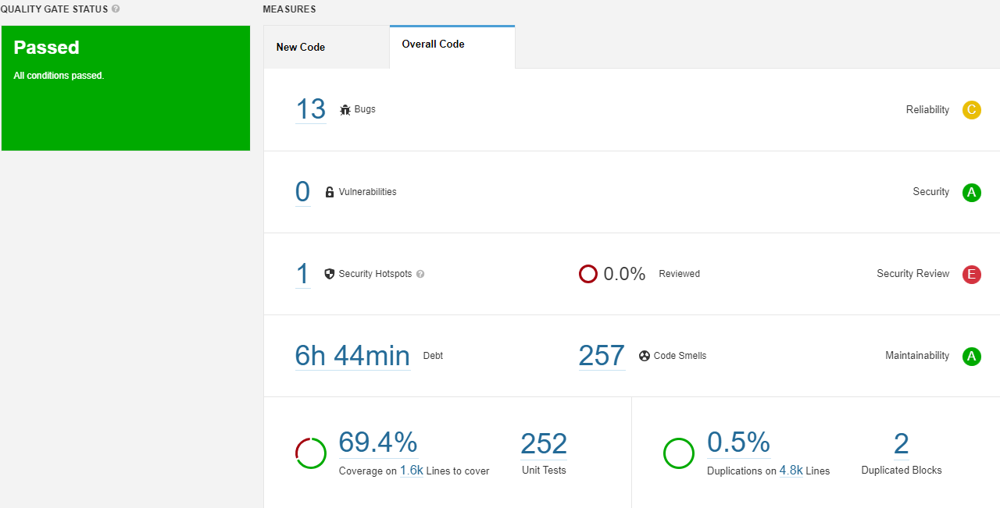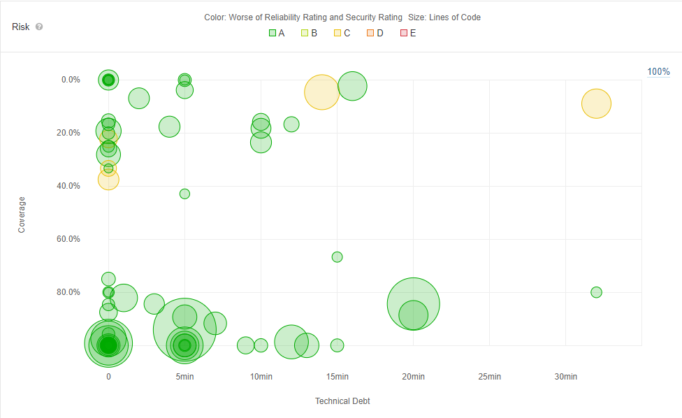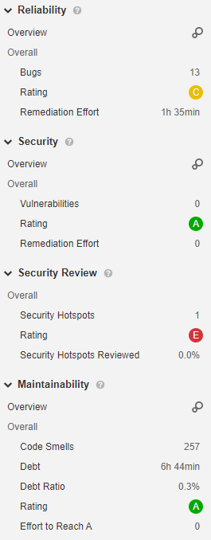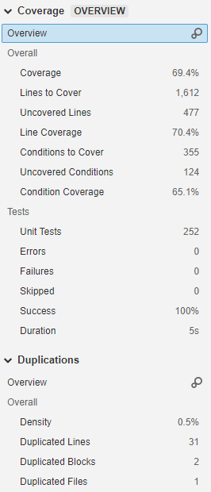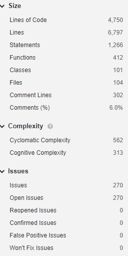

### 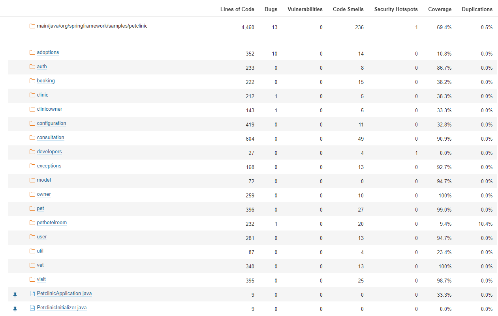

### FrontEnd 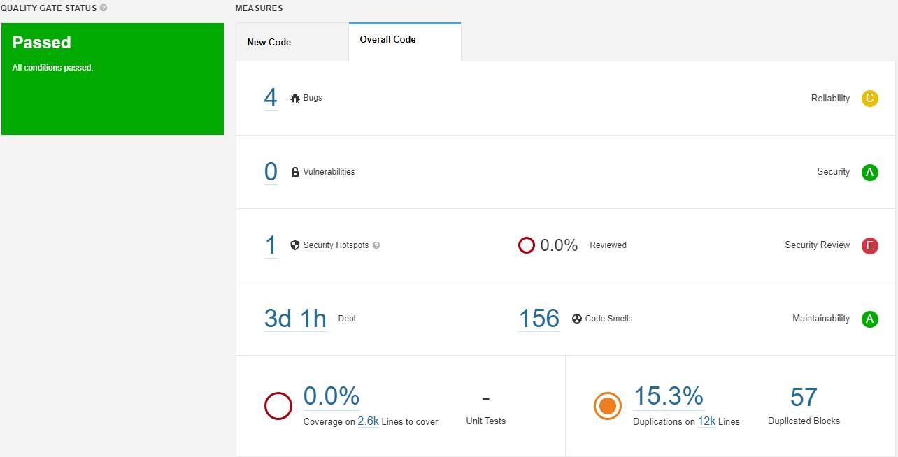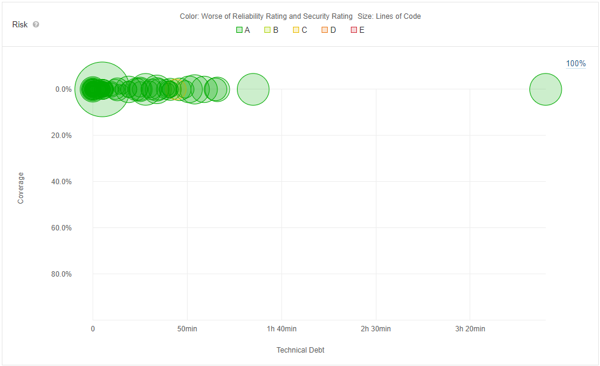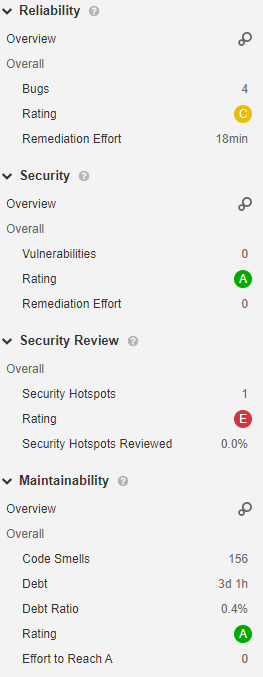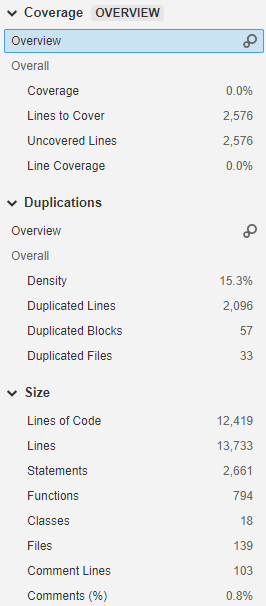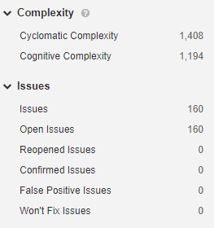

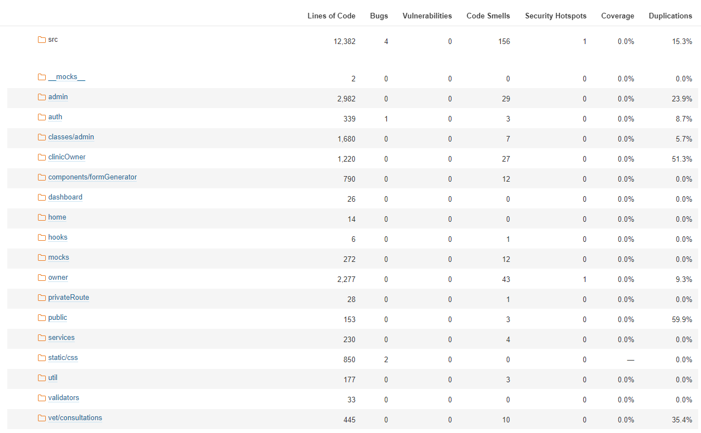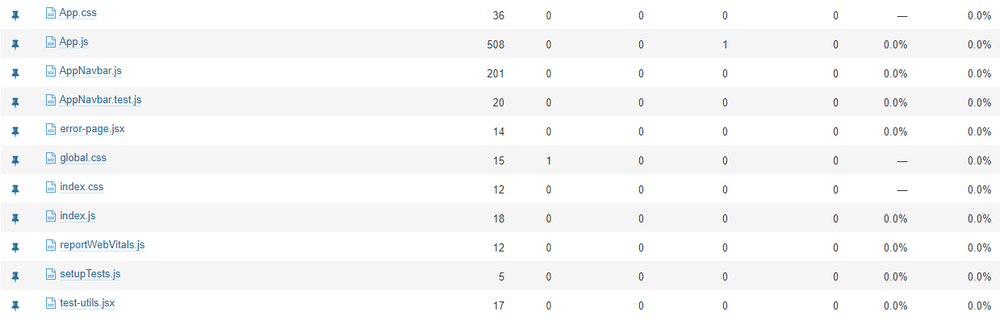

## Información sobre Issues

### Backend

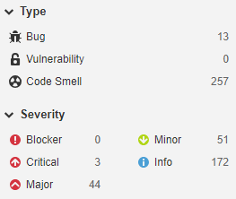

### Frontend

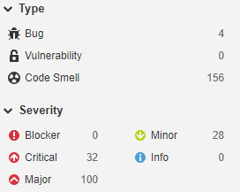

# 4. Descripción y análisis de bugs potenciales

Tenemos 13 bugs en Backend que se repiten y quedan en 2 realmente; por otro lado en el Frontend tenemos 4 bugs que se repiten por estilado de fuente y otros varios.

## Bugs Potenciales en Backend

### 1\# Tipo de Bug

**Descripción:** En la siguiente línea del método se ve lo siguiente: adoptationRepository.findById(adoptationId).get();

**Análisis**: Se trata de un bug mayor, dado que la adopción puede no existir y por tanto hacer un get a un nulo y lanzar una excepción de NoSuchElementException.

**Solución**: Se solucionaría haciendo uso de .isPresent() en un if, donde si el valor existe se realiza el get.

### 2\#Tipo de Bug

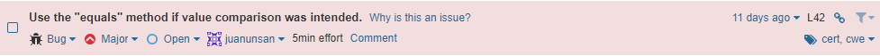

**Descripción**: Se usa el operador == para comparación de Integers en la línea de código perteneciente if(offer.getOfferingOwner().getUser().getId() == userId)

Lo mismo sucede para otras líneas de otros ficheros:

**Análisis:** Se trata de un bug mayor, dado que este tipo de comparación no compara los valores almacenados en ambos campos de la comparación sino sus localizaciones en memoria. Por lo tanto, la evaluación es errónea.

**Solución:** Se solucionaría cambiando el operador == por equals.

## Bugs Potenciales en Frontend

### 3\# Tipo de Bug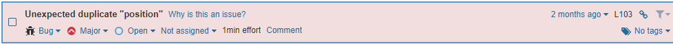

**Descripción**: Se encontró un duplicado inesperado del identificador "position" en el código.

**Análisis:** El uso de un identificador duplicado puede llevar a confusiones y errores en el código. En este caso, la presencia de dos elementos con el mismo nombre puede causar ambigüedad y dificultar el mantenimiento y la comprensión del código.

**Solución:** Para resolver este problema, se debe renombrar uno de los elementos duplicados, asegurándose de que cada identificador sea único dentro del alcance relevante.

### 4\# Tipo de Bug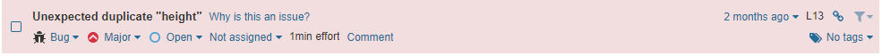

**Descripción**: Se ha identificado un duplicado inesperado del identificador "height" en el código.

**Análisis:** La presencia de dos elementos con el mismo nombre, en este caso "height", puede generar confusión y dificultar la comprensión del código. Esto podría llevar a errores y dificultades durante el desarrollo y mantenimiento del software.

**Solución:** Para resolver este problema, se recomienda renombrar uno de los elementos duplicados, asegurándose de que cada identificador sea único dentro del contexto en el que se utiliza.

### 5\# Tipo de Bug

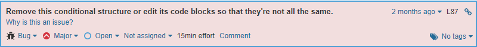

**Descripción**: Se ha detectado una estructura condicional redundante en el código.

**Análisis:** La estructura condicional actual presenta bloques de código idénticos en todas sus ramas. Esto sugiere una redundancia en la lógica de control de flujo y puede ser innecesario para el propósito previsto.

**Solución:** Para resolver este problema, se recomienda eliminar la estructura condicional si no es necesaria o modificar los bloques de código para que no sean todos iguales. Esto puede implicar ajustar las condiciones o introducir lógica adicional para diferenciar los casos.

### 6\# Tipo de Bug

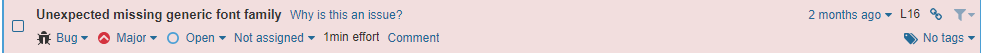

**Descripción**:Se ha identificado una falta inesperada de la especificación de una familia genérica de fuentes en el código.

**Análisis:** La falta de especificación de una familia genérica de fuentes puede causar problemas de renderizado en diferentes entornos y dispositivos. Esto puede llevar a una apariencia inconsistente del texto en la interfaz de usuario.

**Solución:** Para resolver este problema, se recomienda especificar una familia genérica de fuentes como respaldo en caso de que la fuente primaria no esté disponible. Esto ayuda a garantizar una apariencia consistente del texto en diferentes contextos de visualización.

# 6. Descripción y análisis de Vulnerabilidades

Las vulnerabilidades en el código pueden incluir problemas como inyección de código, XSS, CSRF, exposición de datos sensibles y desbordamiento de búfer. El análisis de vulnerabilidades implica identificar, clasificar y priorizar estas vulnerabilidades. Se utilizan herramientas de análisis estático y pruebas para este fin. Las vulnerabilidades se remedian mediante parches de seguridad y cambios en el diseño de la aplicación.

En nuestro caso no hemos encontrado ni se nos ha presentado errores de Vulnerabilidades tanto en Backend como Frontend.

# 7. Descripción y análisis de los code smells

### 1\# Code smell

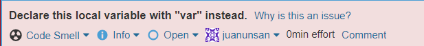

**Descripción:** El code smell implica declarar explícitamente una variable local con un tipo específico cuando el tipo puede ser inferido de manera implícita usando la palabra clave var.

**Causas:** Prácticas de codificación habituales o convencionales que prefieren la declaración explícita de tipos.

**Severidad:** Afecta la legibilidad y mantenibilidad del código.

**Solución:** En lugar de declarar explícitamente el tipo, utiliza la palabra clave var para permitir que el compilador infiera el tipo según el valor asignado.

### 2\# Code smell

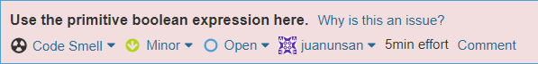

**Descripción**: Este code smell implica el uso de una expresión booleana primitiva (== false o == true) en lugar de utilizar directamente el valor booleano.

**Causas**: Prácticas de codificación habituales que hacen un uso excesivo de comparaciones booleanas explícitas.

**Severidad**: La severidad de este code smell es relativamente baja en términos de funcionalidad, pero puede afectar la legibilidad y la mantenibilidad del código. Utilizar una expresión booleana directa en lugar de una comparación explícita puede hacer que el código sea más claro y menos propenso a errores.

**Solución**: En lugar de comparar con == false, simplemente use la negación ! del valor booleano.

### 

### 3\# Code smell

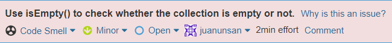

**Descripción**: Este code smell consiste en usar size() == 0 para verificar si una colección está vacía en lugar de utilizar el método isEmpty() proporcionado por la interfaz de la colección.

**Causas**: Costumbres heredadas de otros lenguajes de programación donde size() es la forma más común de verificar la longitud de una colección.

**Severidad**: Este code smell no suele tener un gran impacto en la funcionalidad del código, pero puede afectar la legibilidad y la eficiencia. Usar isEmpty() es más claro y expresa la intención de manera más directa que size() == 0.

**Solución**: Utilizar isEmpty(): En lugar de verificar size() == 0, utilizar el método isEmpty() proporcionado por las clases de colección en Java.

### 4\# Code smell

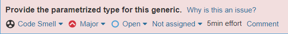

**Descripción**: Este code smell se produce al no especificar el tipo parametrizado para un genérico en una declaración de método o clase, lo que puede llevar a la pérdida de seguridad de tipos y a la ambigüedad en el código.

**Causas**: Descuido o falta de atención al detalle al escribir código.

**Severidad**: Este code smell puede tener un impacto moderado en la legibilidad y la seguridad del código, especialmente en proyectos grandes y complejos donde la falta de especificación del tipo puede causar confusión y errores de compilación.

**Solución**: Especificar el Tipo Parametrizado: Proporciona el tipo parametrizado para el genérico en la declaración del método o clase.

### 5\# Code smell

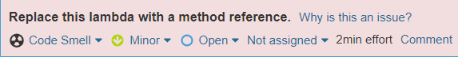

**Descripción**: Este code smell ocurre cuando se utiliza una lambda para realizar una operación simple que podría ser reemplazada por una referencia a método, lo que puede mejorar la legibilidad y la concisión del código.

**Causas**: No aprovechar todas las características del lenguaje Java moderno.

**Severidad**: Este code smell es leve y principalmente afecta la legibilidad y la estética del código. Sin embargo, el uso de referencias a método puede hacer que el código sea más claro y conciso.

**Solución**: Utilizar una referencia a método en lugar de la lambda para operaciones simples.

### 6\# Code smell

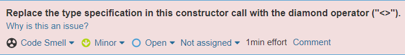

**Descripción**: Este code smell ocurre cuando se especifica el tipo de datos en una llamada al constructor cuando se puede usar el operador diamante (\<\>) para inferir el tipo automáticamente.

**Causas**: Costumbres heredadas de versiones anteriores de Java donde el operador diamante no estaba disponible.

**Severidad**: Este code smell es leve y principalmente afecta la estética y la claridad del código. Sin embargo, el uso del operador diamante puede hacer que el código sea más limpio y conciso.

**Solución**: Reemplaza la especificación del tipo en la llamada al constructor con el operador diamante (\<\>).

### 7\# Code smell

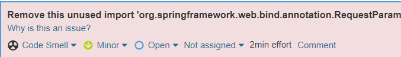

**Descripción**: Importación no utilizada

**Causas**: Olvido o descuido al limpiar el código después de hacer cambios.

**Severidad**: Este code smell es leve y principalmente afecta la estética del código. Sin embargo, una acumulación de importaciones no utilizadas puede hacer que el código sea menos legible y mantener una base de código más grande de lo necesario.

**Solución**: Elimina la importación no utilizada del código.

### 8\# Code smell

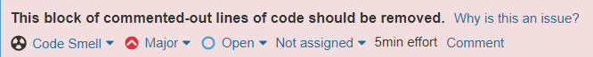

**Descripción**: Este code smell ocurre cuando se incluyen bloques de código comentados en el código fuente. Los bloques de código comentados pueden aumentar la confusión y dificultar la comprensión del código activo.

**Causas**: Falta de limpieza del código después de hacer cambios.

**Severidad**: Este code smell es leve y principalmente afecta la legibilidad y la estética del código. Los bloques de código comentados pueden hacer que el código sea más difícil de entender y pueden causar confusión, especialmente para los nuevos desarrolladores que trabajan en el proyecto.

**Solución**: Elimina completamente los bloques de código comentados del código fuente.

### 9\# Code smell

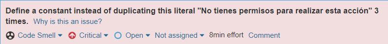

**Descripción**: Este code smell ocurre cuando se utiliza el mismo literal en múltiples lugares del código en lugar de definirlo una vez como una constante y reutilizarlo en todo el código. Esto puede hacer que el código sea más propenso a errores y dificultar su mantenimiento.

**Causas**: Descuido o falta de atención al detalle.

**Severidad**: Este code smell es leve y principalmente afecta la legibilidad y la mantenibilidad del código. El uso repetitivo de literales puede hacer que el código sea menos claro y más difícil de mantener, especialmente si el literal necesita ser actualizado en el futuro.

**Solución**: Definir una constante para el literal y usarla en lugar de repetir el mismo texto en múltiples lugares del código.

### 10\# Code smell

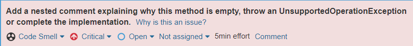

**Descripción**: Este code smell ocurre cuando se define un constructor vacío en una clase sin comentarios que expliquen su propósito o razón para estar vacío. Esto puede llevar a confusión para otros desarrolladores que revisen el código y puede indicar una falta de mantenimiento o implementación incompleta.

**Causas**: Olvido de añadir comentarios explicativos durante el desarrollo.

**Severidad**: Este code smell puede tener un impacto leve en la legibilidad y la mantenibilidad del código. Aunque un constructor vacío puede ser válido en ciertos casos, la falta de explicación puede causar confusión sobre su propósito.

**Solución**: Añade un comentario dentro del constructor explicando la razón por la cual está vacío. Esto puede incluir información sobre la intención de implementar funcionalidad en una etapa posterior.

### 11\# Code smell

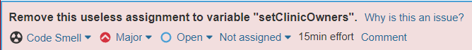

**Descripción**: Este code smell ocurre cuando se asigna un valor a una variable que no se utiliza en ninguna parte del código. Esto puede conducir a confusión y aumentar la complejidad del código sin ningún beneficio real.

**Causas**: Falta de atención al refactorizar o modificar el código existente.

**Severidad**: Este code smell es de baja gravedad, ya que no afecta directamente la funcionalidad o la estabilidad del código. Sin embargo, puede causar confusión y hacer que el código sea más difícil de entender para otros desarrolladores.

**Solución**: Simplemente eliminar la asignación a la variable si no se utiliza en ninguna parte del código.

### 12\# Code smell

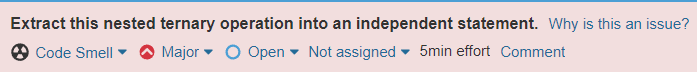

**Descripción**: Este code smell se presenta cuando se utiliza una operación ternaria anidada para tomar decisiones complejas. Esto puede hacer que el código sea difícil de entender y dar lugar a errores.

**Causas**: Falta de familiaridad con otras estructuras de control de flujo más legibles.

**Severidad**: Este code smell tiene una gravedad baja a moderada. Aunque no afecta directamente la funcionalidad del código, puede dificultar la comprensión y mantenimiento del mismo, especialmente para otros desarrolladores que lo revisen.

**Solución**: Divide la operación ternaria en declaraciones independientes para hacer el código más legible y modular.

### 13\# Code smell

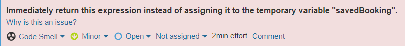

**Descripción**: Este code smell se presenta cuando se asigna un valor a una variable temporal que no se utiliza más adelante en el código, especialmente cuando esta variable temporal se utiliza únicamente para almacenar el resultado de una expresión que se devuelve de inmediato.

**Causas**: Patrones de programación heredados de otros lenguajes donde la asignación temporal es más común.

**Severidad**: Este code smell tiene una gravedad baja. Aunque no afecta directamente la funcionalidad del código, puede dificultar la comprensión y el mantenimiento del mismo, especialmente para otros desarrolladores que lo revisen.

**Solución**: Devuelve la expresión directamente en lugar de asignarla a una variable temporal.

### 7.1\#. Code Smell Solutions

### 12\# Code smell
### - Backend:
### 1\# Use the primitive boolean expression here.
### 2\# Remove the unnecessary boolean literal.
### - Code Smell: adoptions/AdoptationController.java
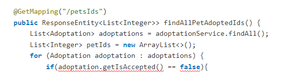
### - Solution:
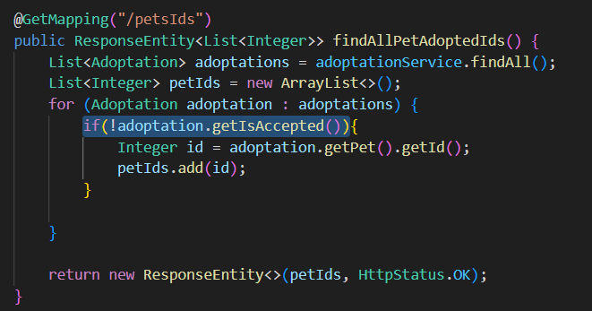

### 3\# Declare this local variable with var instead.
### - Code Smell: adoptions/AdoptationService.java
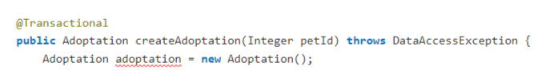
### - Solution:
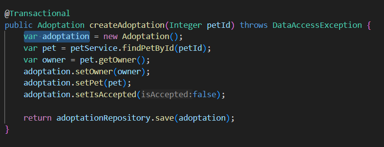

### 4\# Declare this local variable with var instead.
### - Code Smell: adoptions/AdoptationService.java

### - Solution:
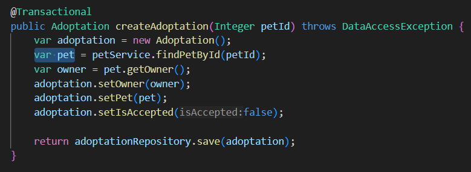

### 5\# Declare this local variable with var instead.
### - Code Smell: adoptions/AdoptationService.java

### - Solution:
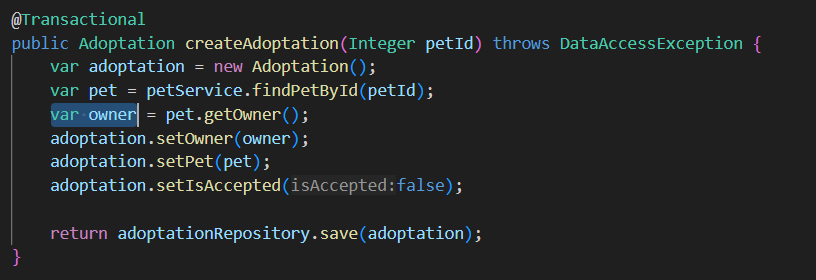

## 6\# Declare this local variable with var instead.
### - Code Smell: adoptions/OfferController.java
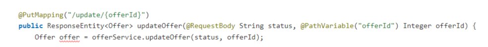
### - Solution:
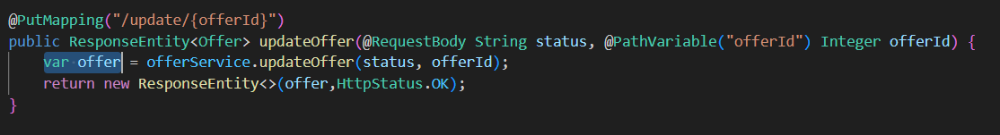

### 7\# Use the primitive boolean expression here.
### 8\# Remove the unnecessary boolean literal.
### - Code Smell: adoptions/OfferController.java
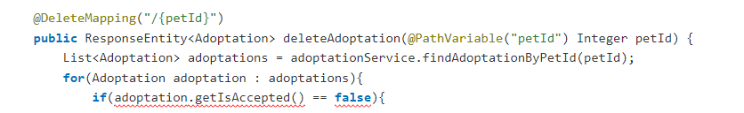
### - Solution:
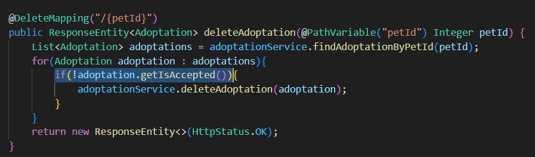

### 9\# Call "Optional#isPresent()" before accesing the value".
### - Bug: adoptions/OfferService.java
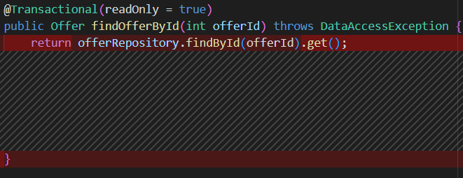
### - Solution:
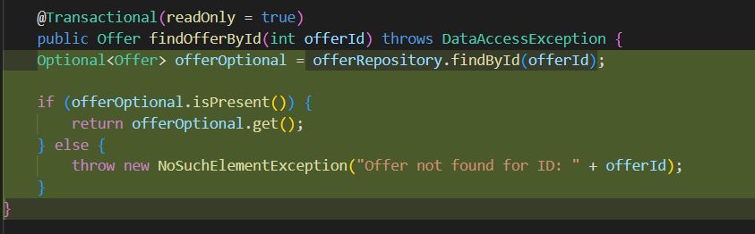

### 10\# Use the "equals" method if value comparison was intended.
### - Bug: adoptions/OfferService.java
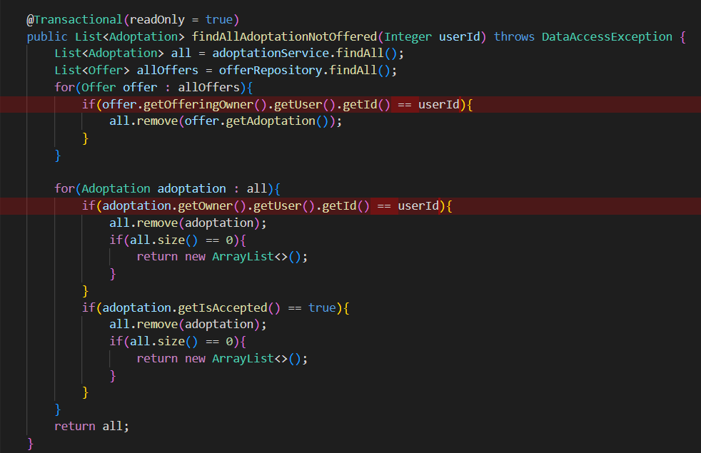
### - Solution:
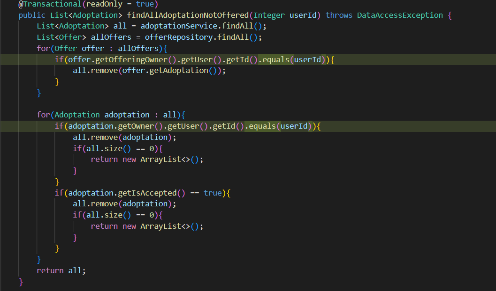

### 11\# Use the "equals" method if value comparison was intended.
### - Bug: adoptions/OfferService.java
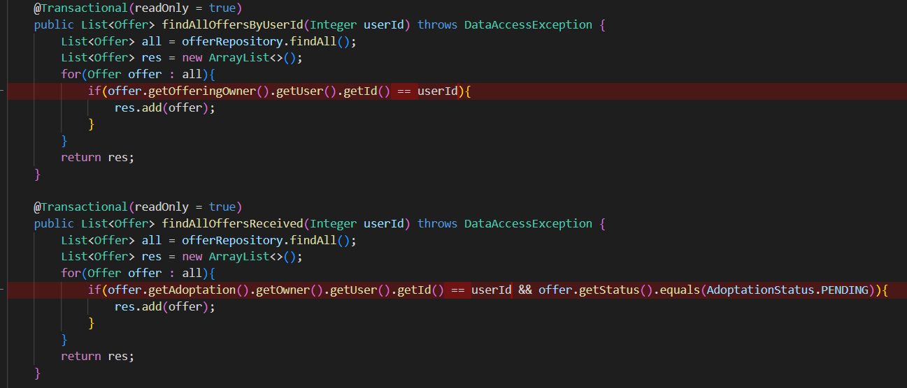
### - Solution:
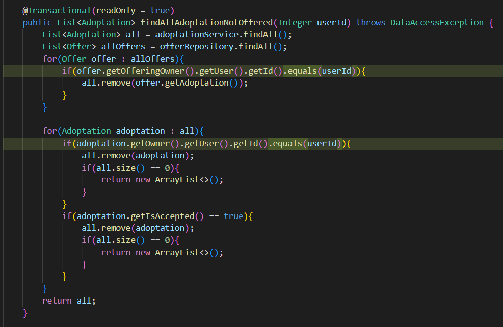

### 12\# Call "Optional#isPresent()" before accesing the value".
### - Bug: adoptions/OfferService.java
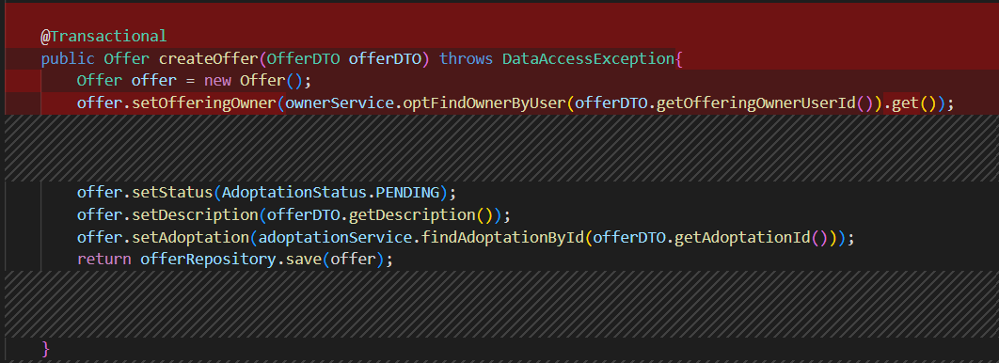
### - Solution:
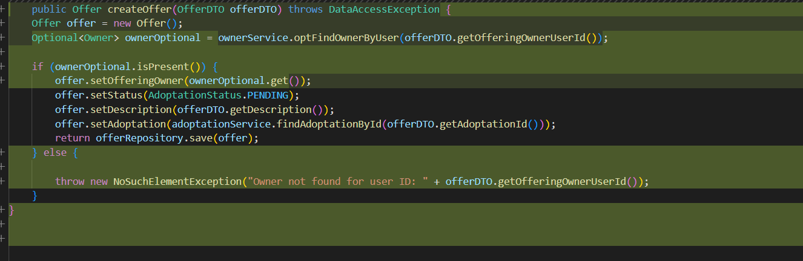

### 13\# Use the "equals" method if value comparison was intended.
### - Bug: adoptions/OfferService.java
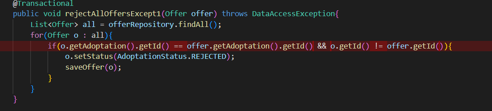
### - Solution:
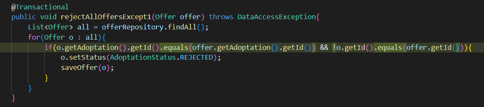

### 14\# Use the "equals" method if value comparison was intended.
### - Bug: adoptions/OfferService.java
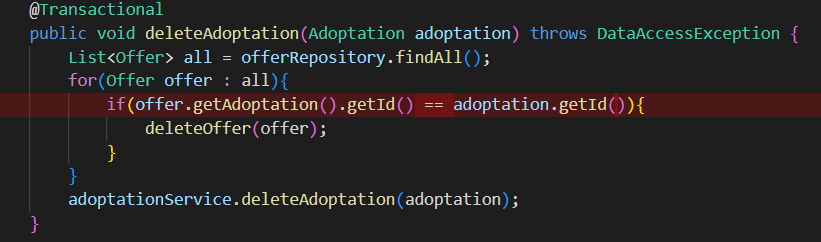
### - Solution:
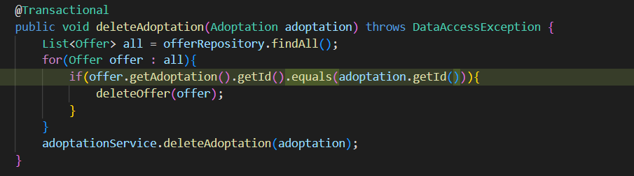

### 15\# Define a constant instead of duplicating this literal "No tienes permisos para realizar esta acción" 3 times.
### - Critical Bug: booking/BookingController.java
### - Solution:
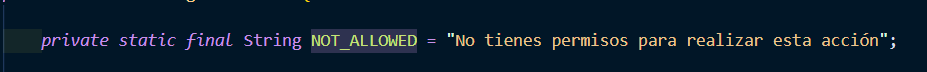

### 16\# This block of commented-out lines of code should be removed.
### - Major Bug: petclinic/user/UserService.java
### - Solution:
### - Solo elimine lineas comentarias de varios archivos, pero pongo como referencia a este .java

### - Frontend:
### 1\# Remove this conditional structure or edit its code blocks so that they're not all the same.
### -  Bug:  src/auth/register/index.js
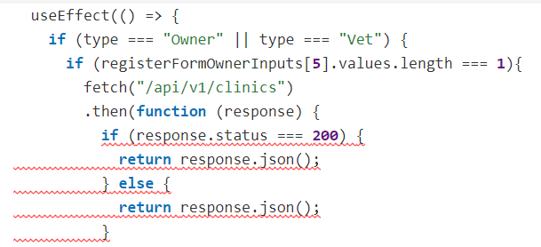
### - Solution:
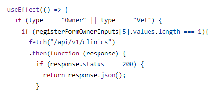

### 2\# Unexpected duplicate "position"
### -  Bug:  src/static/css/owner/consultations.css
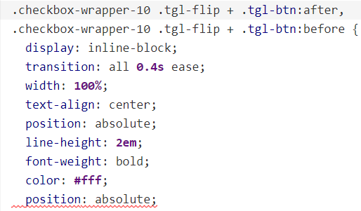
### - Solution:
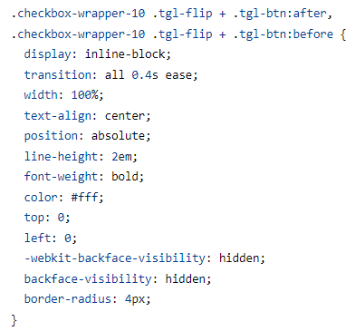

### 3\# Unexpected duplicate "height"
### -  Bug:  src/static/css/owner/editPet.css
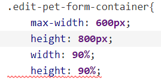
### - Solution:
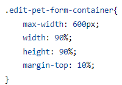

# 8. Conclusiones

En conclusión, hemos detectado y analizado todos los bugs, vulnerabilidades y code smells de nuestro proyecto. Hemos entendido varios de nuestros errores al programar, trataremos de solucionarlos y esperamos no volver a repetirlos.

Respecto a la deuda técnica, ha incrementado en casi dos horas, cantidad que intentaremos reducir de cara al siguiente Sprint.
