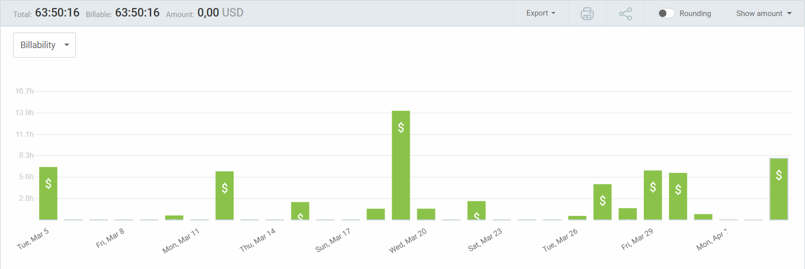
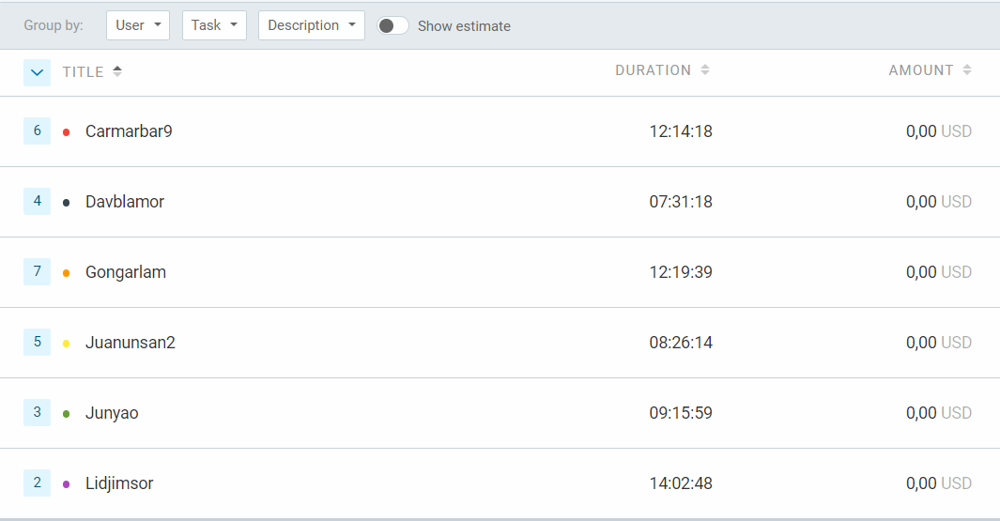
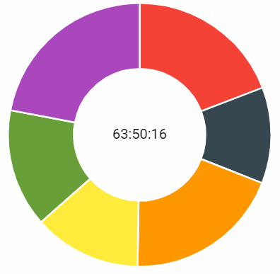

Universidad de Sevilla  
 Escuela Técnica Superior de Ingeniería Informática

**Documentación de la entrega M02**

**Documento de Clockify**

Grado en Ingeniería Informática – Ingeniería del Software

Proceso y Gestión Software 2

Curso 2023 – 2024

| **Fecha**  | **Versión** |
|------------|-------------|
| 03/04/2024 | v1r1        |

| **Grupo de prácticas: G5-54**    |               |                        |
|----------------------------------|---------------|------------------------|
| **Autores**                      | **Rol**       | **Correo electrónico** |
| Blanco Mora, David               | Developer     | davblamor@alum.us.es   |
| García Lama, Gonzalo             | Scrum Manager | gongarlam@alum.us.es   |
| Martín de Prado Barragán, Carlos | Developer     | carmarbar9@alum.us.es  |
| Juan Núñez Sánchez               | Developer     | juanunsan2@alum.us.es  |
| Jiménez Soriano, Lidia           | Developer     | lidjimsor@alum.us.es   |
| Yao, Jun                         | Developer     | junyao@alum.us.es      |

Repositorio: <https://github.com/gii-is-psg2/psg2-2324-g5-54>

**Índice de contenido**

[**1. Introducción 2**](#1-introducción)

[**2. Control de Versiones 2**](#2-control-de-versiones)

[**3. Horas de Clockify 3**](#3-horas-de-clockify)

[**4. Conclusiones 5**](#4-conclusiones)

# 1. Introducción

Con Clockify, cada miembro del equipo tiene la capacidad de registrar y monitorear su tiempo de manera individual, proporcionando una visión detallada de cómo se distribuyen las horas a lo largo del día y de los proyectos. Esta información no solo ayuda a entender mejor cómo se utilizan los recursos, sino que también facilita la planificación futura y la toma de decisiones informadas.

# 2. Control de Versiones

| **Fecha**  | **Versión** | **Descripción**                      |
|------------|-------------|--------------------------------------|
| 03/04/2024 | v1r0        | Generación del documento             |
| 03/04/2024 | v1r1        | Finalización del documento y entrega |
|            |             |                                      |
|            |             |                                      |

# 

# 3. Horas de Clockify

En general se ha ido trabajando después de la primera semana. Se puede observar como al final del todo se emplearon muchas numerosas horas de parte del equipo para llegar a los objetivos necesitados, sobre todo se ha trabajado en horas no lectivas como Semana Santa.

A medida que se avanza en el proyecto, es posible que se descubran detalles adicionales que necesitan ser abordados o refinados, lo que puede llevar más tiempo del previsto inicialmente.

A medida que se desarrolla el software, es común encontrarse con problemas técnicos o de diseño que requieren tiempo adicional para solucionarlos.

A continuación se puede ver filtrado el número de horas empleado por cada miembro del equipo, con cuantas tareas registradas que ha participado, en Clockify[numerito]

Por último se muestra en proporción la cantidad de horas en un gráfico de torta.

Los respectivos porcentajes son:

Gonzalo; 19,31%

Lidia; 22,00%

David; 11,78%

Carlos; 19,17%

Jun; 14,52%

Juan; 13,22%

# 4. Conclusiones

 El equipo ha trabajado de forma intercalada,y no tan continuada, se ve como al final se tuvo que ir apurado para poder finalizar la entrega. Varios miembros han tenido que suplir esa carga de trabajo, pero finalmente todos los miembros del equipo pudieron emplear sus esfuerzos para el proyecto.

Las mejoras se comentarán en el respectivo documento, pero hay que mejorar si o si la carga de trabajo para que sea equitativa entre los miembros del equipo y no llegue a ser tan desgastante para algunos, ni tan leve para otros.

 También intentaremos cuidar el estar más pendientes al Clockify enlazando a las tareas de GitHub, para que sea más preciso. A su vez esperamos que se reduzcan el número de entradas manuales a Clockify.

# 

# 

# 

# 
