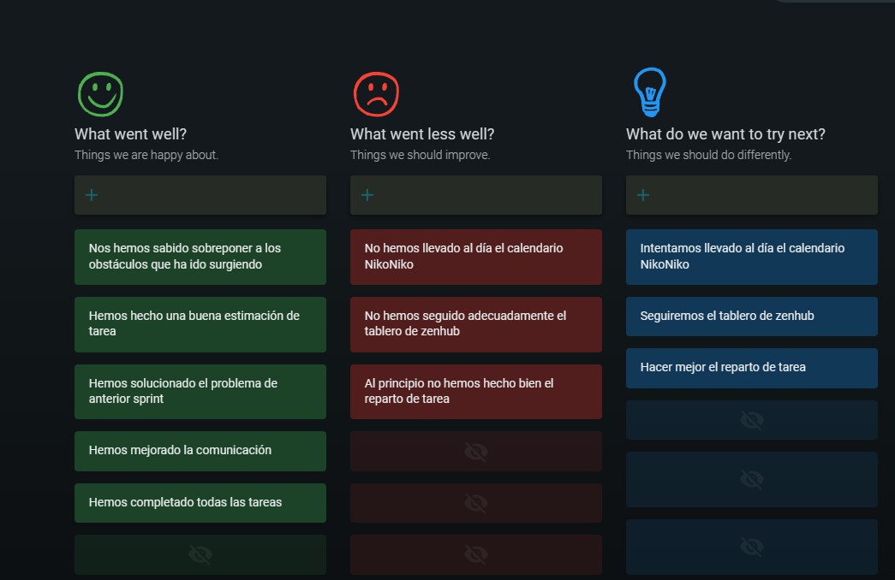

Universidad de Sevilla  
 Escuela Técnica Superior de Ingeniería Informática

**Documentación de la entrega M02**

**Documentación Sprint Retrospective**

Grado en Ingeniería Informática – Ingeniería del Software

Proceso y Gestión Software 2

Curso 2023 – 2024

| **Fecha**  | **Versión** |
|------------|-------------|
| 03/04/2024 | v1r1        |

| **Grupo de prácticas: G5-54**    |               |                        |
|----------------------------------|---------------|------------------------|
| **Autores**                      | **Rol**       | **Correo electrónico** |
| Blanco Mora, David               | Desarrollador | davblamor@alum.us.es   |
| García Lama, Gonzalo             | Scrum Manager | gongarlam@alum.us.es   |
| Martín de Prado Barragán, Carlos | Desarrollador | carmarbar9@alum.us.es  |
| Juan Núñez Sánchez               | Desarrollador | juanunsan2@alum.us.es  |
| Jiménez Soriano, Lidia           | Desarrollador | lidjimsor@alum.us.es   |
| Yao, Jun                         | Desarrollador | junyao@alum.us.es      |

Repositorio: <https://github.com/gii-is-psg2/psg2-2324-g5-54>

**Índice de contenido**

[**1. Introducción 2**](#1-introducción)

[**2. Control de Versiones 2**](#2-control-de-versiones)

[**3. Evaluaciones 2**](#3-evaluaciones)

[**4. Valoración Sprint de los integrantes del grupo. 3**](#4-valoración-sprint-de-los-integrantes-del-grupo)

[4.1 Aspecto de mejoras: 4](#41-aspecto-de-mejoras)

[**5. Conclusión 5**](#5-conclusión)

# 1. Introducción

En el presente documento, a raíz de lo realizado en el segundo Sprint, se han puesto en común entre los miembros del grupo, aspectos a mejorar y a contemplar de cara a futuros sprints con el fin de garantizar que se incorporen los aprendizajes clave para las futuras entregas.

# 2. Control de Versiones

| **Fecha**  | **Versión** | **Descripción**                        |
|------------|-------------|----------------------------------------|
| 02/04/2024 | v1r0        | Primera versión del documento          |
| 03/04/2024 | v1r1        | Adición del contenido punto 3, 4 y 5   |

# 3. Evaluaciones

# 

# 

# 

# 4. Valoración Sprint de los integrantes del grupo.

# 

|                                  | Sprint |      |      |      |      |       |                     |
|----------------------------------|--------|------|------|------|------|-------|---------------------|
| Miembro del Equipo               | S1     | S2   | S3   | S4   | S5   | Total | Media Entregable D2 |
| Blanco Mora, David               | 5      | 5    | 4,75 | 4,75 | 5    | 24,5  | 4,9                 |
| García Lama, Gonzalo             | 5      | 5    | 5,15 | 5,2  | 5,25 | 25,6  | 5,12                |
| Martín de Prado Barragán, Carlos | 5      | 5    | 5    | 5    | 5    | 25    | 5                   |
| Núñez Sánchez, Juan              | 5      | 5    | 5    | 5    | 5    | 25    | 5                   |
| Jiménez Soriano, Lidia           | 5      | 5    | 5,1  | 5,3  | 5    | 25,4  | 5,08                |
| Yao, Jun                         | 5      | 5    | 5    | 4,75 | 4,75 | 24,5  | 4,9                 |
| Total                            | 30     | 30   | 30   | 30   | 30   | 150   | 30                  |

## 

## 

## 4.1 Aspecto de mejoras:

Hemos elaborado las notas de esta forma en función al nivel de compromiso y los trabajos realizados con el grupo. Durante este segundo Sprint, hemos notado una mejoría en la comunicación entre todos los integrantes del equipo, hemos sabido equilibrar correctamente las cargas de trabajo y ha habido un buen compromiso por parte de todos los integrantes. A pesar de esto, hubo un cambio en la organización de las tareas, pero no debido al compromiso, sino al tiempo disponible de cada uno.

Con respecto a Clockify se ha mejorado el compromiso, aunque algún integrante olvidó iniciar el cronómetro al iniciar algunas tareas que le correspondían, por lo que este tiempo tuvo que ser añadido de manera manual.

# 5. Conclusión

En general, durante este Sprint 2 se ha trabajado de manera eficiente y coordinada. Los integrantes del grupo han resuelto las dudas que surgían entre ellos y han proporcionado ayuda a quien la necesitaba, por lo que la comunicación y el trabajo en equipo han resultado excelentes. 

A pesar de haber trabajo bien como equipo, hay varias cosas a mejorar para los siguientes Sprints, como puede ser, sobre todo, el seguimiento del Sprint desde Zenhub, ya que el tablero no se utilizó correctamente en varias ocasiones y dió lugar a gráficos mediocres.

Para los próximos Sprints se intentará mejorar lo mencionado anteriormente, ya que nos ayudará a seguir nuestras tareas de una manera más ordenada.

# 

# 
