<table><tr><th colspan="1" rowspan="2">![ref1]</th><th colspan="1" valign="top">PSG2 Documentación de la entrega Milestone 03</th></tr>
<tr><td colspan="1" valign="top">Monitorización del Acuerdo de Cliente de PetClinic Services</td></tr>
</table>

Universidad de Sevilla

Escuela Técnica Superior de Ingeniería Informática

***Monitorización del Acuerdo de Cliente de***

***PetClinic Services***

Grado en Ingeniería Informática – Ingeniería del Software Proceso y Gestión Software 2

Curso 2023 – 2024

|**Grupo de prácticas: G5-54**|||
| - | :- | :- |
|**Autores**|**Rol**|**Correo electrónico**|
|Blanco Mora, David|Desarrollador|davblamor@alum.us.es|
|García Lama, Gonzalo|Scrum Master|gongarlam@alum.us.es|
|Martín de Prado Barragán, Carlos|Desarrollador|carmarbar9@alum.us.es|
|Juan Núñez Sánchez|Desarrollador|juanunsan2@alum.us.es|
|Jiménez Soriano, Lidia|Desarrollador|lidjimsor@alum.us.es|
|Yao, Jun|Desarrollador|junyao@alum.us.es|

Repositorio: <https://github.com/gii-is-psg2/psg2-2324-g5-54>

<table><tr><th colspan="1" rowspan="2">![ref1]</th><th colspan="1" valign="top">PSG2 Documentación de la entrega Milestone 03</th></tr>
<tr><td colspan="1" valign="top">Monitorización del Acuerdo de Cliente de PetClinic Services</td></tr>
</table>

**Índice de contenido**

1. [**Control de Versiones 2**](#_page1_x72.00_y309.10)
1. [**Pricing plans description 3**](#_page2_x72.00_y131.32)
1. [**Identify current plan: 6**](#_page5_x72.00_y145.86)
1. [**Remove the “Plan” page for pet owners: 8**](#_page7_x72.00_y160.41)
1. [**Upgrade plan to Clinic 3: 11**](#_page10_x72.00_y160.41)
1. [**API-based extensions 13** ](#_page12_x72.00_y131.32)[7.-Capturas Github 14** ](#_page15_x72.00_y160.41)[8.-Conclusión 15**](#_page16_x72.00_y157.77)
1. Control de Versiones

|**Fecha**|**Versión**|**Descripción**|
| - | - | - |
|2/05/2024|v1r0|Inicialización del documento|
|8/05/2024|v1r1|Finalización del documento y revisión|
||||
||||

<table><tr><th colspan="1" rowspan="2">![ref1]</th><th colspan="1" valign="top">PSG2 Documentación de la entrega Milestone 03</th></tr>
<tr><td colspan="1" valign="top">Monitorización del Acuerdo de Cliente de PetClinic Services</td></tr>
</table>

2. Pricing plans description

**Grado de cumplimiento con el plan Basic para prioridad alta:**

- TTO definido por el SLA: 28 horas.
- TTR definido por el SLA: 36 horas.

Tiempos en este documento para comprobar el TTO:

- Creación de la petición:

  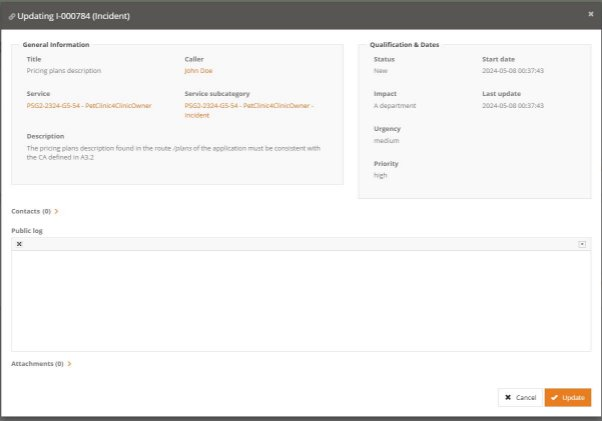

<table><tr><th colspan="1" rowspan="2">![ref1]</th><th colspan="1" valign="top">PSG2 Documentación de la entrega Milestone 03</th></tr>
<tr><td colspan="1" valign="top">Monitorización del Acuerdo de Cliente de PetClinic Services</td></tr>
</table>

- **Asignación de la petición:**

  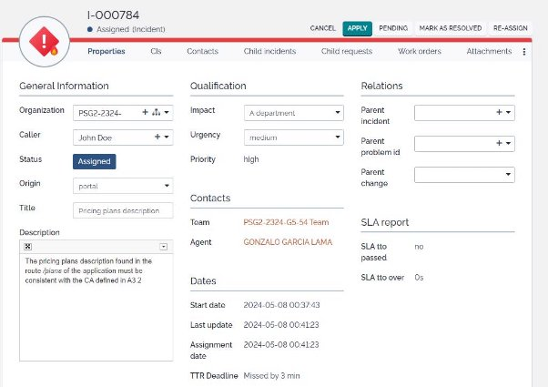

- **Resolución de la petición:**

  

<table><tr><th colspan="1" rowspan="2">![ref1]</th><th colspan="1" valign="top">PSG2 Documentación de la entrega Milestone 03</th></tr>
<tr><td colspan="1" valign="top">Monitorización del Acuerdo de Cliente de PetClinic Services</td></tr>
</table>

- **Incident Log**

  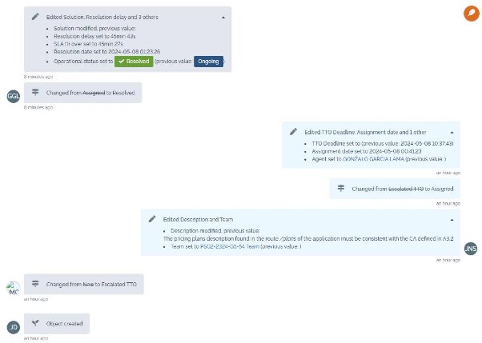

  **TTO real:** 4 minutos **TTR real:** 45 min 27 s

<table><tr><th colspan="1" rowspan="2">![ref1]</th><th colspan="1" valign="top">PSG2 Documentación de la entrega Milestone 03</th></tr>
<tr><td colspan="1" valign="top">Monitorización del Acuerdo de Cliente de PetClinic Services</td></tr>
</table>

3. Identify current plan:

**Grado de cumplimiento con el plan Basic para prioridad crítica:**

- TTO definido por el SLA: 20 horas.
- TTR definido por el SLA: 24 horas.

Tiempos en este documento para comprobar el TTO:

- Asignación de la petición:

  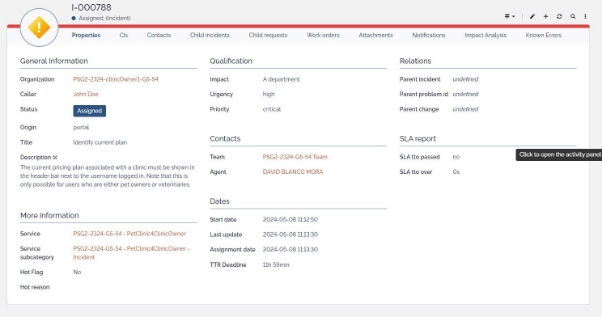

<table><tr><th colspan="1" rowspan="2">![ref1]</th><th colspan="1" valign="top">PSG2 Documentación de la entrega Milestone 03</th></tr>
<tr><td colspan="1" valign="top">Monitorización del Acuerdo de Cliente de PetClinic Services</td></tr>
</table>

- Incident Log:

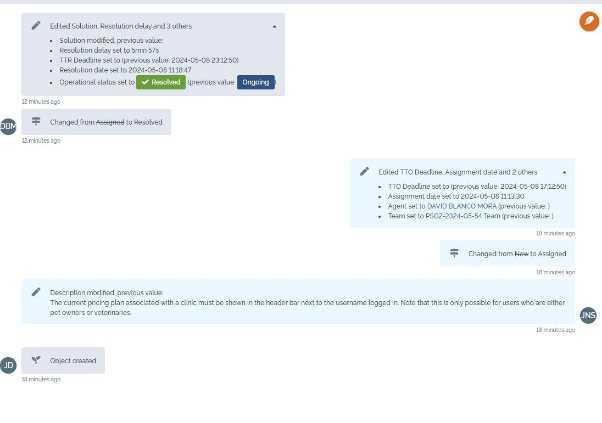

- TTO real:1 min 30 s
- TTR real:5 min 57 s

<table><tr><th colspan="1" rowspan="2">![ref1]</th><th colspan="1" valign="top">PSG2 Documentación de la entrega Milestone 03</th></tr>
<tr><td colspan="1" valign="top">Monitorización del Acuerdo de Cliente de PetClinic Services</td></tr>
</table>

4. Remove the “Plan” page for pet owners:

**Grado de cumplimiento con el plan Basic para prioridad alta:**

- TTO definido por el SLA: 28 horas.
- TTR definido por el SLA: 36 horas.

Tiempos en este documento para comprobar el TTO:

- **Creación de la petición:**

  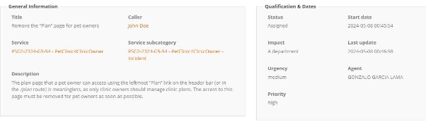

- **Asignación de la petición:**

  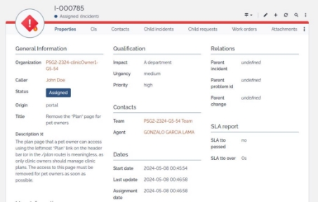

<table><tr><th colspan="1" rowspan="2">![ref1]</th><th colspan="1" valign="top">PSG2 Documentación de la entrega Milestone 03</th></tr>
<tr><td colspan="1" valign="top">Monitorización del Acuerdo de Cliente de PetClinic Services</td></tr>
</table>

- **Resolución de la petición:**

  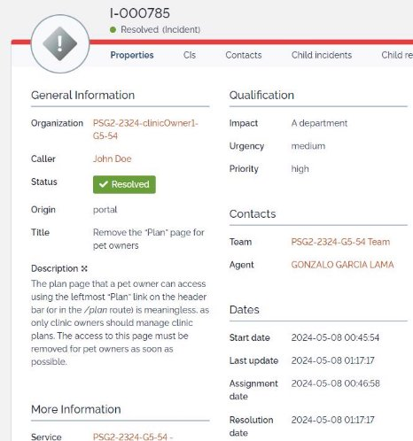

<table><tr><th colspan="1" rowspan="2">![ref1]</th><th colspan="1" valign="top">PSG2 Documentación de la entrega Milestone 03</th></tr>
<tr><td colspan="1" valign="top">Monitorización del Acuerdo de Cliente de PetClinic Services</td></tr>
</table>

- **Incident Log:**

  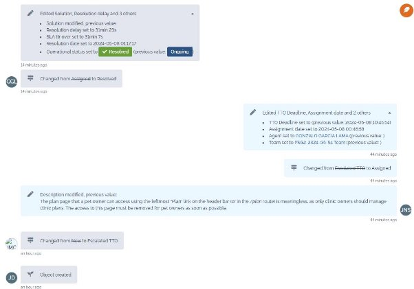

- TTO real: 1 min
- TTR real:31 min 7s

<table><tr><th colspan="1" rowspan="2">![ref1]</th><th colspan="1" valign="top">PSG2 Documentación de la entrega Milestone 03</th></tr>
<tr><td colspan="1" valign="top">Monitorización del Acuerdo de Cliente de PetClinic Services</td></tr>
</table>

5. Upgrade plan to Clinic 3:

**Grado de cumplimiento con el plan Basic para prioridad alta:**

- TTO definido por el SLA: 28 horas.
- TTR definido por el SLA: 36 horas.

Tiempos en este documento para comprobar el TTO:

- **Creación de la petición:**

  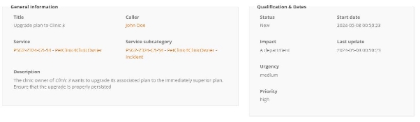

<table><tr><th colspan="1" rowspan="2">![ref1]</th><th colspan="1" valign="top">PSG2 Documentación de la entrega Milestone 03</th></tr>
<tr><td colspan="1" valign="top">Monitorización del Acuerdo de Cliente de PetClinic Services</td></tr>
</table>

- **Asignación y Resolución de la petición:**

  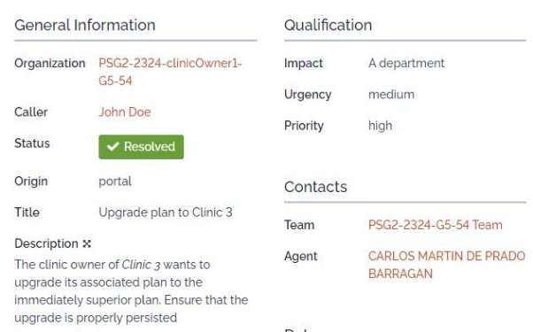

- **Incident Log**

  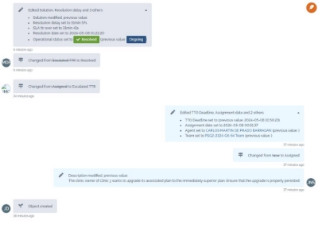

- **TTO real:** 1 min 30 s
- **TTR real:** 31 min 41s

<table><tr><th colspan="1" rowspan="2">![ref1]</th><th colspan="1" valign="top">PSG2 Documentación de la entrega Milestone 03</th></tr>
<tr><td colspan="1" valign="top">Monitorización del Acuerdo de Cliente de PetClinic Services</td></tr>
</table>

6. API-based extensions

**Grado de cumplimiento con el plan Basic para prioridad critical:**

- TTO definido por el SLA: 28 horas.
- TTR definido por el SLA: 36 horas.

Tiempos en este documento para comprobar el TTO:

- Creación de la petición:

  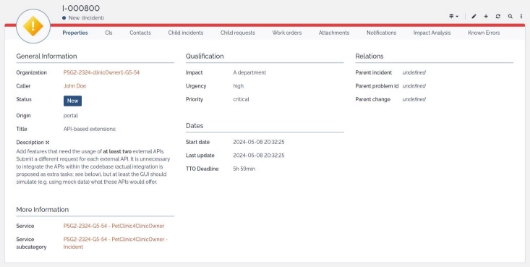

<table><tr><th colspan="1" rowspan="2">![ref1]</th><th colspan="1" valign="top">PSG2 Documentación de la entrega Milestone 03</th></tr>
<tr><td colspan="1" valign="top">Monitorización del Acuerdo de Cliente de PetClinic Services</td></tr>
</table>

- Asignación de la petición:

  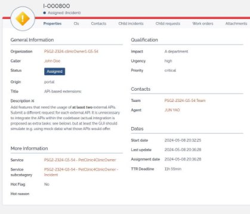

- Resolución de la petición:

  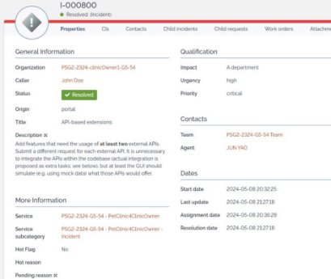

<table><tr><th colspan="1" rowspan="2">![ref1]</th><th colspan="1" valign="top">PSG2 Documentación de la entrega Milestone 03</th></tr>
<tr><td colspan="1" valign="top">Monitorización del Acuerdo de Cliente de PetClinic Services</td></tr>
</table>

- Log Incident:

  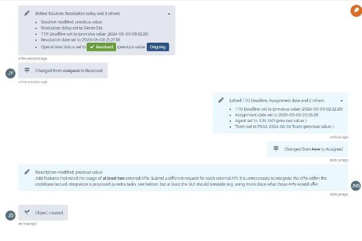

- TTO real:4 min
- TTR real:54 min 52 s

<table><tr><th colspan="1" rowspan="2">![ref1]</th><th colspan="1" valign="top">PSG2 Documentación de la entrega Milestone 03</th></tr>
<tr><td colspan="1" valign="top">Monitorización del Acuerdo de Cliente de PetClinic Services</td></tr>
</table>

\-

7.-Capturas Github

- Tareas creadas

  

  

- Tareas cerradas: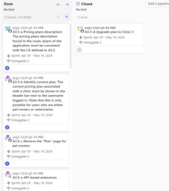

<table><tr><th colspan="1" rowspan="2">![ref1]</th><th colspan="1" valign="top">PSG2 Documentación de la entrega Milestone 03</th></tr>
<tr><td colspan="1" valign="top">Monitorización del Acuerdo de Cliente de PetClinic Services</td></tr>
</table>

8.-Conclusión

Se ha observado que durante la monitorización del CA mediante Itop los tiempos establecidos en el CA (tanto como para TTR y TTO) son notoriamente mayores a los reales ya qué en el CA se establecen tiempos en horas y las incidencias se han logrado resolver en varios minutos.

No obstante, queremos justificar que no será necesario cambiar los TTR y TTO en el CA ya que nos parecen más reales para una empresa real.Los resultados que hemos obtenido se deben a qué se han resuelto uno por uno y con una cara de trabajo baja, pero si atendemos al futuro es posible que la disponibilidad de los desarrolladores sea menor. Por ello hemos considerado oportuno establecer tiempos mayores en el CA para así no arriesgar y contar con más margen por si ocurriera un contratiempò.

Por otro lado no se ha considerado las capturas desde Github ya qué estas se crearon como tareas a principio del sprint, por tanto sus valores serían irreales y muy disparejos con respecto a los de itop.

Finalmente, comentar que debido a disponibilidad de integrantes del grupo ha sido imposible crear parejas de trabajo para que un integrante se la asigne a otro una tarea y viceversa.

[ref1]: Aspose.Words.e06106e7-bf8d-4946-972c-6402421a1d00.001.png
