Universidad de Sevilla  
 Escuela Técnica Superior de Ingeniería Informática

**Implementación de iTop para la Organización**

Grado en Ingeniería Informática – Ingeniería del Software

Proceso y Gestión Software 2

Curso 2023 – 2024

| **Fecha**  | **Versión** |
|------------|-------------|
| 01/05/2024 | v1r1        |

| **Grupo de prácticas: G5-54**    |               |                        |
|----------------------------------|---------------|------------------------|
| **Autores**                      | **Rol**       | **Correo electrónico** |
| Blanco Mora, David               | Developer     | davblamor@alum.us.es   |
| García Lama, Gonzalo             | Scrum Manager | gongarlam@alum.us.es   |
| Martín de Prado Barragán, Carlos | Developer     | carmarbar9@alum.us.es  |
| Juan Núñez Sánchez               | Developer     | juanunsan2@alum.us.es  |
| Jiménez Soriano, Lidia           | Developer     | lidjimsor@alum.us.es   |
| Yao, Jun                         | Developer     | junyao@alum.us.es      |

Repositorio: <https://github.com/gii-is-psg2/psg2-2324-g5-54>

**Índice de contenido**

[**1. Introducción 2**](#1-introducción)

[**2. Control de Versiones 3**](#2-control-de-versiones)

[**3. Screenshots 3**](#3-screenshots)

[**4. Difficulties 9**](#4-difficulties)

[**5. Features missing in iTop 10**](#5-features-missing-in-itop)

[**6. Contributions of each author 11**](#6-contributions-of-each-author)

# 1. Introducción

La intención de este documento es la de demostrar que se ha realizado un buen uso de la herramienta iTop durante este Sprint como se solicitaba hacer asimismo como mostrar la implicación individual de los distintos participantes del equipo en ella.

El documento se estructurará de la siguiente manera:

-   En primer lugar, se presentará una vista del portal de iTop destinada a los usuarios, acompañada de una breve explicación sobre su organización.
-   Posteriormente, se exhibirán las preguntas frecuentes (FAQ) y los problemas reportados por diversos usuarios en la herramienta, mostrando al menos dos ejemplos de cada tipo.
-   A continuación, se detallarán las dificultades encontradas durante la configuración de iTop durante el Sprint 4.
-   Seguidamente, se discutirán las funcionalidades que se consideran necesarias para que iTop se implemente, ya que sin ellas se complica la realización de algunos de los requisitos del Sprint.
-   Finalmente, se dedicará un apartado para incluir las contribuciones individuales de cada miembro del equipo, resaltando los detalles de las tareas específicas realizadas por cada uno.

# 2. Control de Versiones

| **Fecha**  | **Versión** | **Descripción**        |
|------------|-------------|------------------------|
| 03/05/2024 | v1r0        | Creación del documento |
| 04/05/2024 | v2r0        | Relleno de informacion |
|            |             |                        |
|            |             |                        |

# 3. Screenshots

-   Contactos y equipos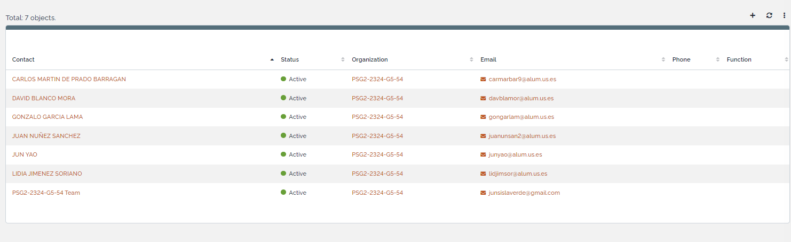
-   Usuarios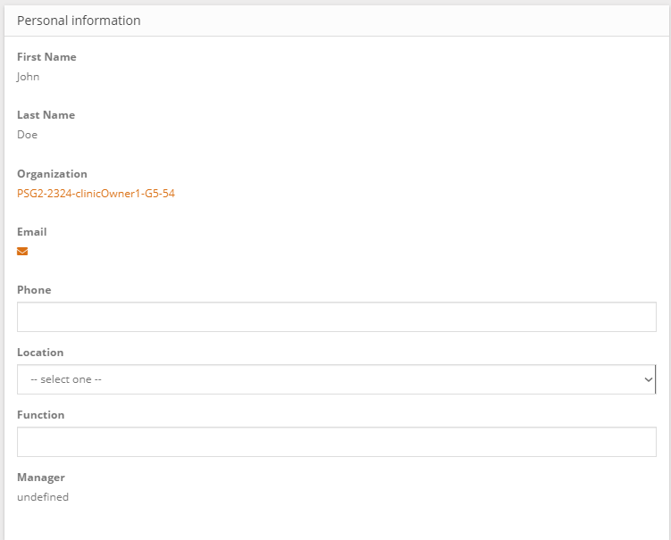

    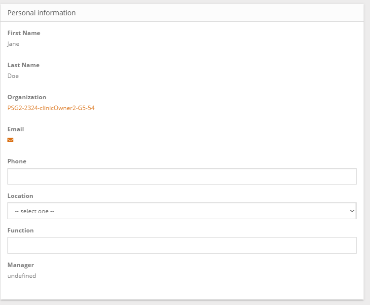

-   Servicios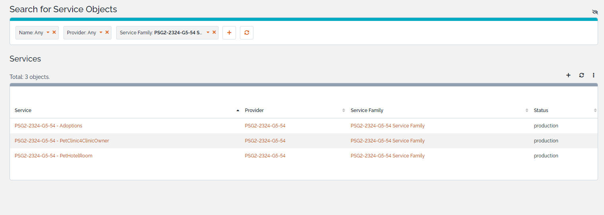
-   SubServicios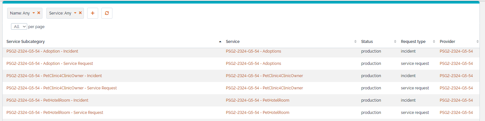
-   Contrato de Cliente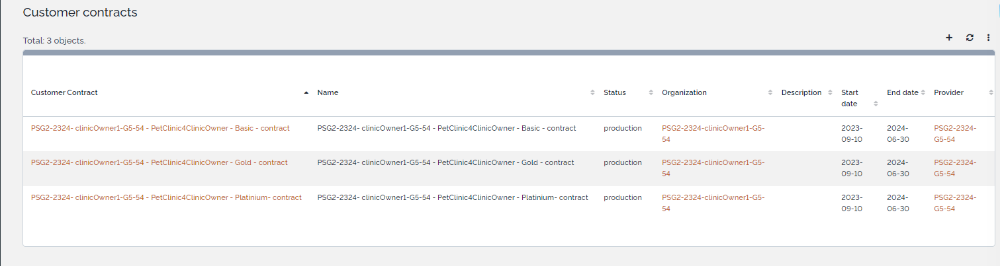

    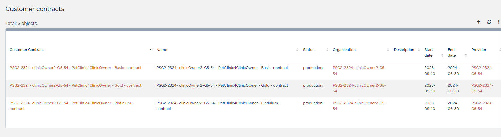

-   SLA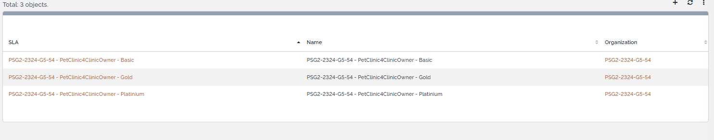
-   SLT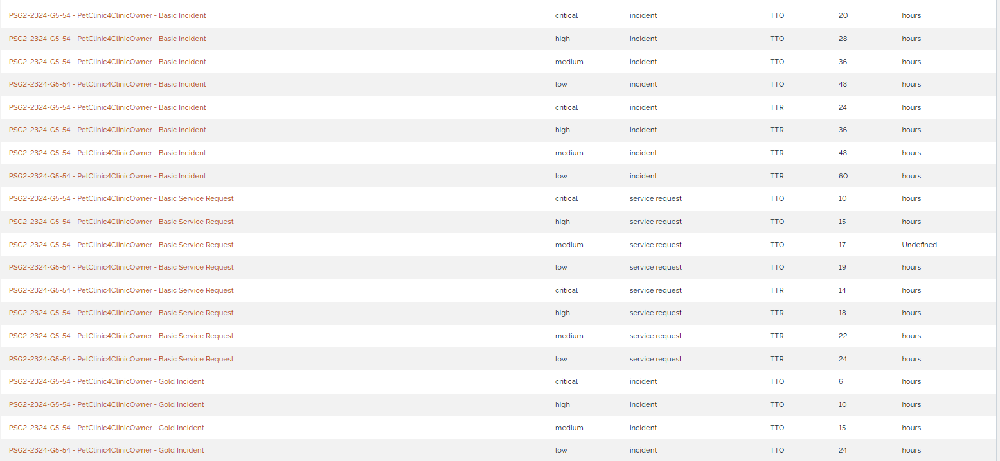

    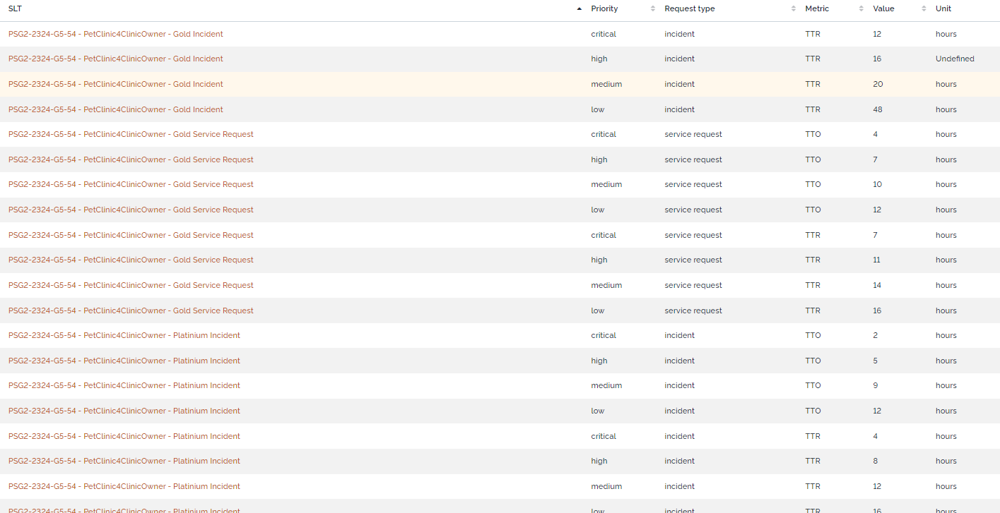

    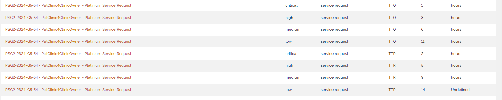

-   DeliveryModel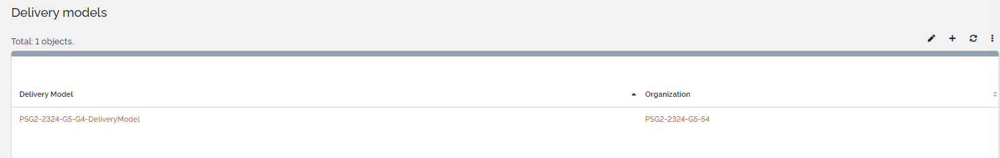
-   Peticiones de Usuario e Incidencias de Prueba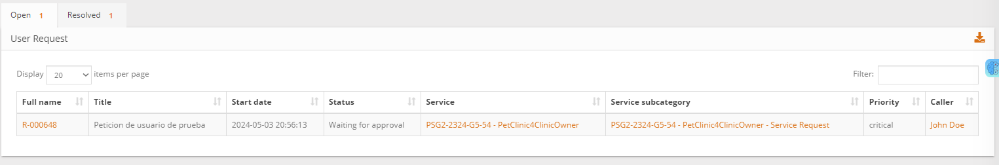
-   FAQ

    

# 4. Difficulties

Tenemos dificultades al definir los elementos del CA en iTop debido a la complejidad y variedad de los términos contractuales y acuerdos de servicio específicos de cada cliente. Algunos elementos del CA podrían no ser fácilmente definibles en iTop debido a la falta de flexibilidad en la estructura predeterminada o la ausencia de campos específicos para ciertos detalles contractuales.

Además, la adaptación de los SLTs y SLAs a los CA dentro de iTop también resultó ser un desafío. La necesidad de alinear los objetivos de tiempo de servicio y los acuerdos de nivel de servicio con los términos contractuales específicos de cada cliente requería una configuración meticulosa y detallada en iTop, lo que implicaba un proceso complejo y laborioso durante el sprint.

Se han definido SLTs asociados a los SLAs correspondientes, y se han asociado los SLAs a los Customer Agreements (CA) definidos en las organizaciones de los clientes.

# 5. Features missing in iTop

Se han detectado las siguientes características faltantes:

1.-La creación de elementos es lenta y no proporciona ningún tipo de facilidad a la hora de crear elementos similares que se diferencian en un único rasgo

2.-iTop no calcula los costos de hardware ni las licencias de las herramientas de desarrollo, por lo tanto, los gastos de capital (capEx) no están representados. Del mismo modo, los salarios y los costos de mantenimiento/soporte de la aplicación no están incluidos, por lo que los gastos operativos (opEx) tampoco se registran en iTop.

# 

# 6. Contributions of each author

A continuación se detallan las distintas aportaciones de los diferentes integrantes del grupo para configuración de itop:

| Nombre     | Aportación                                                                                                                                                                         |
|------------|------------------------------------------------------------------------------------------------------------------------------------------------------------------------------------|
| juanunsan2 | Ha añadido toda la infraestructura en iTop (servicios, FAQ, subcategorías de servicios, SLTs y SLAs definidos en el Acuerdo de Cliente).  Ha añadido su PC con software, contactos |
| carmarbar9 | Ha añadido el equipo de trabajo al Delivery Model.  Ha añadido su PC con software, contactos.                                                                                      |
| gongarlam  | Ha proporcionado apoyo durante el proceso de adición de infraestructura en iTop.  Ha añadido su PC con software, contactos                                                         |
| lidjimsor  | Ha añadido su PC con software, contactos. Ha añadido la Familia de Servicios                                                                                                       |
| davblamor  | Ha añadido su PC con software, contactos. Ha cambiado las contraseñas de los usuarios. Ha añadido contratos de cliente                                                             |
| junyao     | Ha proporcionado apoyo durante el proceso de adición de infraestructura en iTop.  Ha añadido su PC con software, contactos                                                         |
