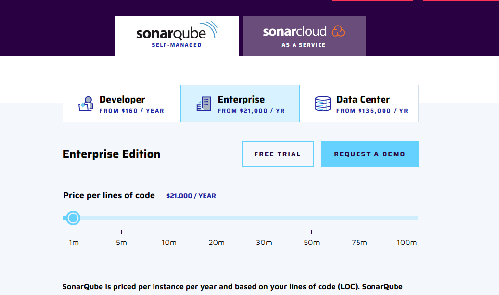
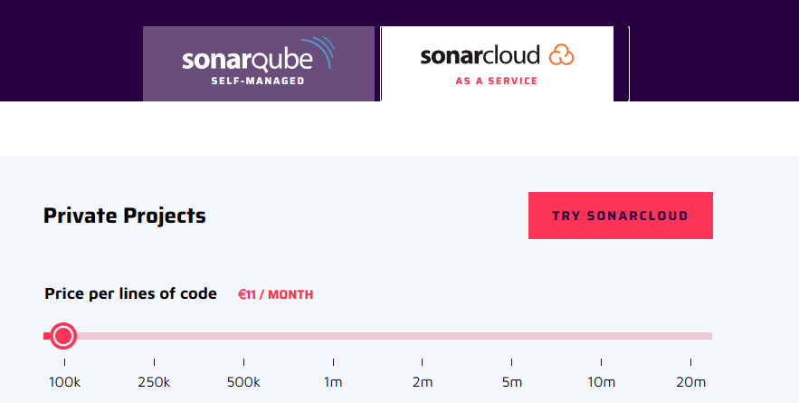

Universidad de Sevilla  
 Escuela Técnica Superior de Ingeniería Informática

**Análisis de la capacidad y el riesgo de** 

**PetClinic Services**

Grado en Ingeniería Informática – Ingeniería del Software

Proceso y Gestión Software 2

Curso 2023 – 2024

| **Fecha**  | **Versión** |
|------------|-------------|
| 08/05/2024 | v1r1        |

| **Grupo de prácticas: G5-54**    |               |                        |
|----------------------------------|---------------|------------------------|
| **Autores**                      | **Rol**       | **Correo electrónico** |
| Blanco Mora, David               | Desarrollador | davblamor@alum.us.es   |
| García Lama, Gonzalo             | Scrum Manager | gongarlam@alum.us.es   |
| Martín de Prado Barragán, Carlos | Desarrollador | carmarbar9@alum.us.es  |
| Juan Núñez Sánchez               | Desarrollador | juanunsan2@alum.us.es  |
| Jiménez Soriano, Lidia           | Desarrollador | lidjimsor@alum.us.es   |
| Yao, Jun                         | Desarrollador | junyao@alum.us.es      |

Repositorio: <https://github.com/gii-is-psg2/psg2-2324-g5-54>

**Índice de contenido**

[**1. Introducción 2**](#1-introducción)

[**2. Control de Versiones 3**](#2-control-de-versiones)

[**3. Estimación del TCO 3**](#3-estimación-del-tco)

[**4. Análisis de la capacidad del servicio extendido de PetClinic 10**](#4-análisis-de-la-capacidad-del-servicio-extendido-de-petclinic)

[**5. Análisis de los riesgos de operación y mantenimiento 11**](#5-análisis-de-los-riesgos-de-operación-y-mantenimiento)

[**6. Bibliografía 12**](#6-bibliografía)

# 1. Introducción

La intención de este documento es la de evaluar, identificar y gestionar los riesgos asociados con el sistema y poder mejorar con ello su capacidad para satisfacer las necesidades y demandas actuales y futuras

El documento se estructurará en las siguientes secciones:

-   Estimación del Coste Total de la Propiedad (TCO): Se elaborará una estimación detallada del coste total de la propiedad del servicio incluido en el Acuerdo de Cliente (CA). Esta estimación abarcará tanto los Gastos Operativos (OpEx) como los Gastos de Capital (CapEx), teniendo en cuenta requisitos específicos. Se proporcionará una descripción exhaustiva de los componentes incluidos en el cálculo del TCO y se analizarán sus implicaciones financieras.
-   Análisis de la Capacidad del Servicio PetClinic: Se examinará la capacidad del servicio PetClinic, evaluando si cumple con el catálogo de operaciones establecido. Se llevará a cabo un análisis exhaustivo de las características y funcionalidades del servicio, comparándolas con los requisitos definidos en el catálogo de operaciones. Se identificarán posibles brechas o áreas de mejora en relación con el cumplimiento de los estándares operativos.
-   Análisis de los Riesgos de Mantenimiento y Operación del Servicio: Se realizará un estudio detallado de los riesgos asociados con el mantenimiento y la operación del servicio incluido en el CA, considerando varios factores relevantes. Se identificarán los riesgos potenciales que podrían afectar la disponibilidad, fiabilidad y seguridad del servicio, así como las estrategias de mitigación correspondientes. Se proporcionará una evaluación integral de los riesgos para informar sobre las medidas preventivas y correctivas necesarias.
-   Todos los datos vamos a intentar ser realista , entonces como estamos en sevilla, vamos a coger los datos de Andalucia.

# 2. Control de Versiones

| **Fecha**  | **Versión** | **Descripción**            |
|------------|-------------|----------------------------|
| 30/04/2024 | v1r0        | Creación del documento     |
| 04/05/2024 | v1r1        | Avance de varios apartados |
| 8/05/2024  | v1r2        | Finalización del documento |
|            |             |                            |

# 3. Estimación del TCO

El Costo Total de Operación (TCO), según ITIL, es una métrica que calcula todos los costos durante el ciclo de vida de una aplicación. Para estimar este costo, se ha desglosado de la siguiente manera para facilitar su comprensión:

-   Gastos en adquisición(CapEx): Estos son los costos fijos asociados con la adquisición de activos a largo plazo que la empresa necesita para desarrollar y mantener Petclinic. A continuación se presenta un esquema que detalla los recursos necesarios que el equipo ha requerido para implementar la aplicación:

Costes de adquisición(CapEx):

|  Costes de Desarrollo | Basado en los sueldos medios en la junta de Andalucía. El sueldo medio es (15,79€/17,72€ /h) elegimos 18 en este caso por siempre tiene que pensar más gasto, y multiplicando las horas que hemos trabajado,ya tenemos un precio total.(a través de clockify consideramos que hemos trabajado 65h) | 1170,00€ |
|-----------------------|----------------------------------------------------------------------------------------------------------------------------------------------------------------------------------------------------------------------------------------------------------------------------------------------------|----------|
| Costes de Instalación | Basado en lo anterior pero las horas sólo dependen del tiempo que se tarde en instalar(2 horas) cada miembro.(6 miembros 10€/h)                                                                                                                                                                    | 120,00€  |
|  Licencias Software   | Licencias de Windows en 2 años para los 6 miembros.(10 euro/cada miembro)                                                                                                                                                                                                                          |  60,00€  |
| Total                 |                                                                                                                                                                                                                                                                                                    | 1350.00€ |

-   Gastos Operativos (OpEx): Esto se refiere al coste permanente del “día a día” de la empresa para su correcto funcionamiento:

Costes de operación(OpEx):

| App Engine                                   | Uso del plan B4 de App Engine,por las horas que está funcionando(8 horas al día),por número de instancias estimadas(50),por el tiempo que el proyecto estará funcionando(24 meses). | 57.600,00€  |
|----------------------------------------------|-------------------------------------------------------------------------------------------------------------------------------------------------------------------------------------|-------------|
| Github                                       | 2 años uso todo el equipo(6 miembros)(gratis)                                                                                                                                       | 0.00€       |
| Clockify                                     |  2 años Clockify.(gratis)                                                                                                                                                           | 0.00€       |
| APIs                                         |  2 años uso de APIs(plan gratis).Hemos utilizado bastantes apis gratuitos relacionados con mascotas, por ejemplo dog y cat, pokémon,rick and morty etc..                            |  0,00€      |
|  Mantenimiento                               | Total mantenimiento al año.Horas De mantenimiento alma esperadas(60 horas),por el salario mensual de desarrollador(consideramos 15€/h)                                              |  1800,00€   |
|  SonarCloud                                  | Total SonarCloud(mas barato que sonarqube) en 2 años por el coste de SonarCloud al año(132€/año)                                                                                    | 264,00€     |
| ITop y equipamiento para atención al cliente | Se puede desplegar en una instancia aparte de App Engine y más un extra                                                                                                             |  2.400,00€  |
| Total                                        |                                                                                                                                                                                     |  62.064,00€ |

En donde el coste de App Engine se traducen la siguiente tabla:

|  Clase de instancia | Coste por hora |  Límite memoria |  Límite CPU |
|---------------------|----------------|-----------------|-------------|
| B4                  | 0,2            | 1024            | 2,4         |

[Precios \| App Engine \| Google Cloud](https://cloud.google.com/appengine/pricing?hl=es)

En donde el coste de sonarqube y sonacloud:

También se tienen en cuenta los costos relacionados con el personal de la empresa que estará disponible durante el período en el que el servicio Petclinic estará operativo. Es importante destacar que, para este cálculo, se considera que el salario de los desarrolladores puede oscilar entre el 0.5% y el 3%. Por lo tanto, se incluyen las siguientes columnas inferior y superior:

Costes de personal:

| Atención al cliente       | Se mide por las horas media sde atención al cliente al mes(30 horas), por el sueldo de atención al cliente por horas(10€),por los meses que la aplicación va a funcionar(24 meses)y por el valor de contingencia(1,2).  | 8.640,00€   |  8.640,00€  |
|---------------------------|-------------------------------------------------------------------------------------------------------------------------------------------------------------------------------------------------------------------------|-------------|-------------|
| Resolución De Incidencias | Se estima por la media de tiempo total de resolución de incidencias al mes(40 horas)por salario horas de desarrollador(15,79€/17,72€)y por el tiempo vida la aplicación(24 meses).y por el valor de contingencia(1,2).  | 18.194,40€  |  19.726,56€ |
| Costes De Formación       |  Tiempo Formación Media Al Año (60€)por el salario medio de desarrollador(15,79€/17,72€)y por la contingencia(1,2).                                                                                                     |  1.137,15€  | 1.232,91€   |
|  Total                    |                                                                                                                                                                                                                         |  27.971,55€ | 29.599,47€  |

También se consideran los costos relacionados con la actualización de software o mejoras en el servicio en respuesta a las solicitudes e incidencias que surjan. Para este cálculo, se contempla que el salario de los desarrolladores puede variar entre el 0.5% y el 3%. Por consiguiente, se incluyen las columnas inferior y superior:

Costes de reemplazo o mejora: inferior superior

|  Costes De Implementación Del Cambio |  Horas dedicadas a implementación cambio al mes(20 horas),por el orabase de desarrollador (15,79€/17,72€),porel tiempo vidade la aplicación(24horas)y por la contingencia(1,2).                        |  9.097,20€ |  9.863,28€ |
|--------------------------------------|--------------------------------------------------------------------------------------------------------------------------------------------------------------------------------------------------------|------------|------------|
|  Costes de actualización de Software | Horas dedicadas a la actualización del software al mes(2horas),por el salario por hora base de un desarrollador (15,79€/17,72€),por el tiempo vidade la aplicación(24horas)y por la contingencia(1,2). |  909,72€   |  986,33€   |
| Costes De Reemplazo De Componentes   | Horas Dedicadas reemplazo de componentes al mes(2horas),por el salario por horade un base de desarrollador (15,79€/17,72€),por el tiempo vidade la aplicación(24horas)y por la contingencia(1,2).      |  909,72€   |  986,33€   |
| Total                                |                                                                                                                                                                                                        | 10.916,64€ | 11.835,94€ |

Siguiendo con los gastos, también se consideran aquellos relacionados con los diferentes riesgos que puedan surgir en el software utilizado, los equipos o cualquier elemento necesario para mantener la aplicación operativa, que podrían resultar en periodos de inactividad. En este cálculo, se tiene en cuenta que el salario de los desarrolladores puede variar entre el 0.5% y el 3%. Por lo tanto, se incluyen las columnas inferior y superior:

Costes de inactividad:

|  Pérdida De Capital      | Pérdida de capital al mes(40€)por el tiempo despliegue de aplicación (24 meses).                                                                 | 960,00€    | 960,00€    |
|--------------------------|--------------------------------------------------------------------------------------------------------------------------------------------------|------------|------------|
|  Costes De Recuperación  |  Tiempo anual de recuperación(2 horas) por el salario por horabasede un desarrollador(15,79€/17,72€),por el tiempo vida la aplicación(24 horas). |  758,10€   |  821,94€   |
|  Costes De Reparación    | Tiempo anual de preparación(20 horas) por salario por horabasedeun desarrollador(15,79€/17,72€),por el tiempo vida la aplicación(24 horas).      |  7.581,00€ | 8.219,40€  |
| Total                    |                                                                                                                                                  |  9.299,10€ | 10.001,34€ |

Finalmente, también se tienen en cuenta los gastos relacionados con el desmantelamiento de algunos de los softwares necesarios para el funcionamiento de la aplicación. Se destaca que, para este cálculo, se considera que el salario de los desarrolladores puede oscilar entre el 0.5% y el 3%. Por tanto, se incluyen las columnas inferior y superior:

Costes de desmantelamiento:

|  Costes De Cambio Servicio De despliegue |  Tiempo de cambio de Despliegue al año(5 horas)por el salario por hora base de un desarrollador(15,79€/17,72€).        |  78,97€   | 85,62€    |
|------------------------------------------|------------------------------------------------------------------------------------------------------------------------|-----------|-----------|
|  Costes de cambio de base de datos       |  Tiempo de cambio de la BBDD al año (5 horas) por el salario por hora base de un desarrollador (15,79€/17,72€).        |  78,97 €  | 85,62 €   |
|  Costes de desintegración con API        |  Tiempo de desintegración de la API al año (5 horas) por el salario por hora base de un desarrollador (15,79€/17,72€). |  78,97 €  | 85,62 €   |
| Total                                    |                                                                                                                        |  236,91 € |  256,86 € |

Finalmente, se obtiene que el precio total del TCO es de: 111.838,2€ en el caso de salario estimado por debajo y 115.107,63€ en caso de salario estimado por encima.

# 4. Análisis de la capacidad del servicio extendido de PetClinic

Hemos realizado estimaciones considerando el plan B4 de AppEngine y centrándonos únicamente en los precios por instancia por hora, excluyendo los costos asociados a la carga de memoria.

¿Cuál es la capacidad máxima de solicitudes por minuto que nuestro sistema puede admitir?

Suponiendo una suscripción al plan y sin exceder los límites establecidos. Utilizamos instancias tipo B4 en App Engine con escalado básico, generando instancias según la demanda del tráfico. Consideramos que 40 instancias operando durante 10 horas al día es una cifra razonable.

Cada instancia puede procesar hasta 100 peticiones simultáneas. Según registros de los logs de App Engine, la latencia promedio por petición tiene un límite superior (percentil 90) de 0.3 segundos. Por lo tanto, el número máximo teórico de solicitudes por minuto sería aproximadamente:

60 0.3 × 100 peticiones/instancia × 40 instancias × 275.74 minuto ≈ 2200 peticiones/minuto 0.3 60 ​ ×100 peticiones/instancia×40 instancias×275.74 minuto≈2200 peticiones/minuto

¿Cuál sería el costo mínimo para atender 2 solicitudes en menos de un minuto?

Suponiendo que una instancia es suficiente para manejar cómodamente 2 peticiones por minuto, operando durante 10 horas al día:

0.25 €/instancia × hora × 1 instancia × 10 horas/día = 2.5 €/día

2.5 €/día / 24 horas/día ≈ 0.104 €/hora

¿Cuál sería el costo mínimo para atender 2 solicitudes por segundo durante 1 hora?

Dado que actualmente una instancia es suficiente y la latencia por petición tiene un límite superior de 0.3 segundos, podemos atender 2 solicitudes por segundo con una única instancia. Esto implicaría un costo de:

0.25 €/instancia × hora × 1 instancia = 0.25 €/hora 0.25 €/instancia \* hora×1 instancia=0.25 €/hora

# 5. Análisis de los riesgos de operación y mantenimiento

Solo se considerará como precio de API externo el costo de AppEngine. Según nuestro análisis del TCO, este costo para los 24 meses es de 57,600 €, lo que equivale a 2,400 € por mes.

Teniendo en cuenta que cada 6 meses este precio puede aumentar de un 2% a un 10%:

En el caso de un aumento máximo (aumento del 10% cada 6 meses), tendríamos que calcular:

1.1\*0\*2400\*6+1.1\*1\*2400\*6+1.1\*1.1\*2400\*6+1.1\*1.1\*1.1\*2400\*6

Con esto, tendríamos que estimar un costo máximo por AppEngine de 66,830.4 €.

En el caso de un aumento mínimo (aumento del 2% cada 6 meses), tendríamos que calcular:

1.02\*0\*2400\*6+1.02\*1\*2400\*6+1.02\*1.02\*2400\*6+1.02\*1.02\*2400\*6

Con esto, tendríamos que estimar un costo mínimo por AppEngine de 59,351.16 €

En relación al costo de los servicios de habilitación y mejora, estos pueden experimentar una variación del 2% al 10% en un período indefinido. Según el análisis del TCO,consideramos el costo de implementación de cambio, que fluctúa entre 9,097.2 € y 9,863.28 € durante los 24 meses.

En caso de un aumento máximo (tomando el precio máximo y un incremento del 10%), se tendría que calcular: 9,863.28 \* 1.1. Esto implicaría presuponer que los servicios de habilitación y mejora podrían costar hasta 10,849.61 €.

En caso de un aumento mínimo (tomando el precio mínimo y un incremento del 2%), se tendría que calcular: 9,097.2 \* 1.02. Esto implicaría presuponer que los servicios de habilitación y mejora podrían costar al menos 9,279.14 €.

Al sumar ambas cifras ya calculadas, podemos observar que deberíamos estimar un costo de aumento máximo de 77,680.68 €, o un costo de aumento mínimo de 68,630.3 €.

# 6. Bibliografía

No procede actualmente
