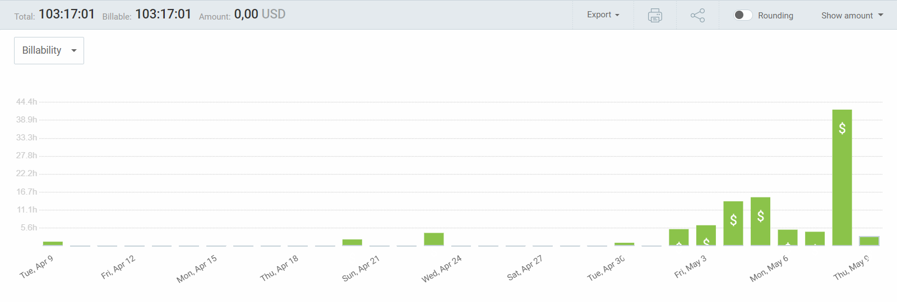
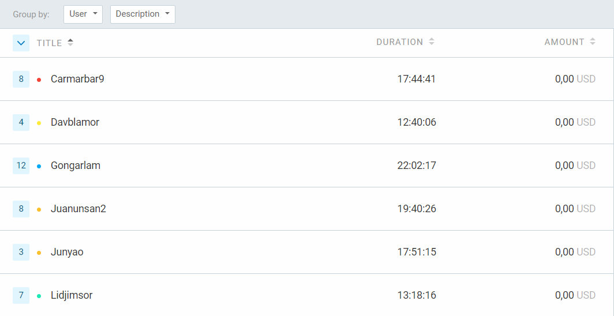
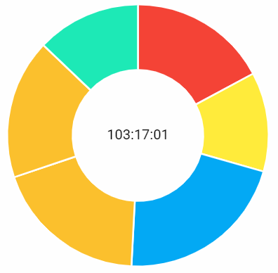

Universidad de Sevilla  
 Escuela Técnica Superior de Ingeniería Informática

**Documentación de la entrega M03**

**Documento de Clockify**

Grado en Ingeniería Informática – Ingeniería del Software

Proceso y Gestión Software 2

Curso 2023 – 2024

| **Fecha**  | **Versión** |
|------------|-------------|
| 09/05/2024 | v1r1        |

| **Grupo de prácticas: G5-54**    |               |                        |
|----------------------------------|---------------|------------------------|
| **Autores**                      | **Rol**       | **Correo electrónico** |
| Blanco Mora, David               | Developer     | davblamor@alum.us.es   |
| García Lama, Gonzalo             | Scrum Manager | gongarlam@alum.us.es   |
| Martín de Prado Barragán, Carlos | Developer     | carmarbar9@alum.us.es  |
| Juan Núñez Sánchez               | Developer     | juanunsan2@alum.us.es  |
| Jiménez Soriano, Lidia           | Developer     | lidjimsor@alum.us.es   |
| Yao, Jun                         | Developer     | junyao@alum.us.es      |

Repositorio: <https://github.com/gii-is-psg2/psg2-2324-g5-54>

**Índice de contenido**

[**1. Introducción 2**](#1-introducción)

[**2. Control de Versiones 2**](#2-control-de-versiones)

[**3. Horas de Clockify 3**](#3-horas-de-clockify)

[**4. Conclusiones 5**](#4-conclusiones)

# 1. Introducción

Con Clockify, cada miembro del equipo tiene la capacidad de registrar y monitorear su tiempo de manera individual, proporcionando una visión detallada de cómo se distribuyen las horas a lo largo del día y de los proyectos. Esta información no solo ayuda a entender mejor cómo se utilizan los recursos, sino que también facilita la planificación futura y la toma de decisiones informadas.

# 2. Control de Versiones

| **Fecha**  | **Versión** | **Descripción**                      |
|------------|-------------|--------------------------------------|
| 05/05/2024 | v1r0        | Generación del documento             |
| 09/05/2024 | v1r1        | Finalización del documento y entrega |
|            |             |                                      |
|            |             |                                      |

# 

# 3. Horas de Clockify

En general se ha ido trabajando después de la primera semana. Se puede observar como al final del todo se emplearon muchas numerosas horas de parte del equipo para llegar a los objetivos necesitados, sobre todo se ha trabajado en horas no lectivas como Semana Santa.

A medida que se avanza en el proyecto, es posible que se descubran detalles adicionales que necesitan ser abordados o refinados, lo que puede llevar más tiempo del previsto inicialmente.

A medida que se desarrolla el software, es común encontrarse con problemas técnicos o de diseño que requieren tiempo adicional para solucionarlos.

A continuación se puede ver filtrado el número de horas empleado por cada miembro del equipo, con sus descripciones que ha participado, en Clockify[numerito]

Por último se muestra en proporción la cantidad de horas en un gráfico de torta.

Los respectivos porcentajes son:

Gonzalo; 21,34%

Lidia; 12,88%

David; 12,27%

Carlos; 17,18%

Jun; 17,29%

Juan; 19,05% (color anaranjado de abajo)

# 4. Conclusiones

# Para esta entrega se ha observado un aumento de la carga de trabajo conforme se acercaba la deadline de la misma, esto es debido a una organización individualizada. No obstante se ha mantenido una comunicación entre el grupo decente, aun así, ha sido crucial subir notoriamente el ritmo la última semana de la entrega.

Por el tiempo observamos que la organización de los últimos días debería de haber sido la constante durante todo el sprint, es por ello que si bien hemos tenido una organización general que no hemos seguido tan completamente, aunque también implica que, una vez logrado los objetivos, hemos aprendido más lecciones para el futuro.

# 

# 

# 

# 
