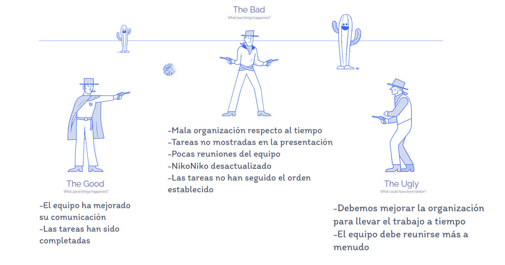

Universidad de Sevilla  
 Escuela Técnica Superior de Ingeniería Informática

**Documentación de la entrega M03**

**Documentación Sprint Retrospective**

Grado en Ingeniería Informática – Ingeniería del Software

Proceso y Gestión Software 2

Curso 2023 – 2024

| **Fecha**  | **Versión** |
|------------|-------------|
| 08/05/2024 | v1r1        |

| **Grupo de prácticas: G5-54**    |               |                        |
|----------------------------------|---------------|------------------------|
| **Autores**                      | **Rol**       | **Correo electrónico** |
| Blanco Mora, David               | Desarrollador | davblamor@alum.us.es   |
| García Lama, Gonzalo             | Scrum Manager | gongarlam@alum.us.es   |
| Martín de Prado Barragán, Carlos | Desarrollador | carmarbar9@alum.us.es  |
| Juan Núñez Sánchez               | Desarrollador | juanunsan2@alum.us.es  |
| Jiménez Soriano, Lidia           | Desarrollador | lidjimsor@alum.us.es   |
| Yao, Jun                         | Desarrollador | junyao@alum.us.es      |

Repositorio: <https://github.com/gii-is-psg2/psg2-2324-g5-54>

**Índice de contenido**

[**1. Introducción 2**](#1-introducción)

[**2. Control de Versiones 2**](#2-control-de-versiones)

[**3. Evaluaciones 2**](#3-evaluaciones)

[**4. Valoración Sprint de los integrantes del grupo. 3**](#4-valoración-sprint-de-los-integrantes-del-grupo)

[4.1 Aspecto de mejoras: 4](#41-aspecto-de-mejoras)

[**5. Conclusión 5**](#5-conclusión)

# 1. Introducción

En el presente documento, a raíz de lo realizado en el segundo Sprint, se han puesto en común entre los miembros del grupo, aspectos a mejorar y a contemplar de cara a futuros sprints con el fin de garantizar que se incorporen los aprendizajes clave para las futuras entregas.

# 2. Control de Versiones

| **Fecha**  | **Versión** | **Descripción**                        |
|------------|-------------|----------------------------------------|
| 04/05/2024 | v1r0        | Generación del documento               |
| 08/05/2024 | v1r1        | Evaluaciones                           |

# 3. Evaluaciones

# 

# 

# 

# 4. Valoración Sprint de los integrantes del grupo.

# 

|                                  | Sprint |      |      |      |      |       |                     |
|----------------------------------|--------|------|------|------|------|-------|---------------------|
| Miembro del Equipo               | S1     | S2   | S3   | S4   | S5   | Total | Media Entregable D3 |
| Blanco Mora, David               | 5      | 5    | 5    | 5    | 5    | 25    | 5                   |
| García Lama, Gonzalo             | 5      | 5    | 5    | 5    | 5    | 25    | 5                   |
| Martín de Prado Barragán, Carlos | 5      | 5    | 5    | 5    | 5    | 25    | 5                   |
| Núñez Sánchez, Juan              | 5      | 5    | 5    | 5    | 5    | 25    | 5                   |
| Jiménez Soriano, Lidia           | 5      | 5    | 5    | 5    | 5    | 25    | 5                   |
| Yao, Jun                         | 5      | 5    | 5    | 5    | 5    | 25    | 5                   |
| Total                            | 30     | 30   | 30   | 30   | 30   | 150   | 30                  |

## 

## 

## 4.1 Aspecto de mejoras:

Las notas han sido elaboradas en función al nivel de compromiso y trabajo de cada integrante del grupo. Durante este tercer sprint se ha trabajado de manera equitativa aunque no eficaz, por eso todos los miembros han recibido la misma nota.

Al principio del sprint se consiguió equilibrar las cargas de trabajo de todos los integrantes, aunque el tiempo pasaba y las tareas no salían adelante.
Aunque cada vez el grupo se entiende mejor, creemos que nuestro fallo ha estado sobre todo en las primeras semanas, ya que vimos la entrega lejos y dejamos el tiempo pasar, sin avanzar lo que deberiamos en las tareas correspondientes. Esto ha hecho que se nos junte todo al final, incluidos otros trabajos de otras asignaturas, aunque no es motivo de excusa, ya que la responsabilidad es nuestra por no haber empezado a trabajar desde el principio del sprint.
Todo esto se va a mejorar para proximas entregas, pero en esta debemos agachar la cabeza, asumir nuestras responsabilidades y pedir perdón.

A parte de todo esto, creemos que el equipo deberia haberse reunido más a menudo para trabajar colectivamente, pues habría favorecido aún más la comunicación y habría facilitado bastante el trabajo de todos.

# 5. Conclusión

En conclusión, el equipo debería haber empezado a trabajar mucho antes y más unido si cabe. Aunque las tareas acaben saliendo adelante, se les debería haber dedicado algo más de tiempo para perfeccionarlas y no hacerlas con prisa al final del sprint.

Creemos que el equipo tiene la capacidad suficiente para trabajar mucho mejor, y por ello todos nuestros fallos serán mejorados de cara a futuras entregas, ya que no basta solo con entregar las tareas, pues éstas deben seguir unos tiempos marcados para poder realizarlas de forma adecuada y que no sean entregadas de una manera mediocre.

También pensamos que las cosas que ha conseguido mejorar el equipo respecto a los sprints anteriores han quedado totalmente opacadas por los fallos cometidos durante este sprint, lo que debe ser una motivación extra para poder mejorar de cara al siguiente sprint.

Por último, volver a aclarar que la toda la responsabilidad de lo sucedido es nuestra y debemos pedir perdón por ello.

# 

# 
